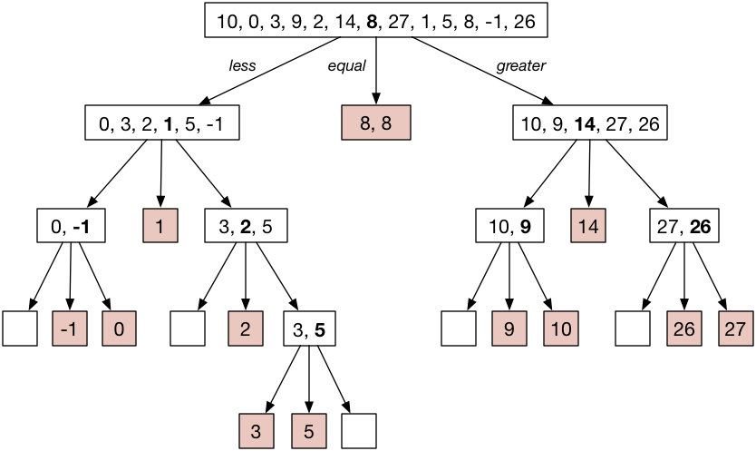

# 快速排序

快速排序（Quicksort），又称分区交换排序（partition-exchange sort）。

### 性能分析

快速排序的最优时间复杂度是 O(n log n)，最坏时间复杂度是 O(n^2)，平均时间复杂度都是 O(n log n)。

### 适用场景

快排通常比较快，它的最坏情况出现的概率很小，但依然需要考虑到。

### 特点

- 不稳定
- 最佳的快排变化版本空间复杂度为 O(log n)

### 排序过程


快速排序使用分治法（Divide and conquer）策略来把一个序列（list）分为较小和较大的2个子序列，然后递归地排序两个子序列。

1. 从数列中挑出一个元素，称为“基准”（pivot）
2. 将所有小于 pivot 的元素放在 pivot 前面，大于 pivot 的元素放在后面，等于 pivot 的元素可以在任意一边
3. **此时 pivot 所在的位置就是它最终的位置**
4. 分别对小于和大于 pivot 的子序列递归地重复 1、2 步骤，直到所有元素都在自己最终位置



实现过程可以通过以下代码来帮助理解：

```swift
func quicksort<T: Comparable>(_ a: [T]) -> [T] {
  guard a.count > 1 else { return a }

  let pivot = a[a.count/2]
  let less = a.filter { $0 < pivot }
  let equal = a.filter { $0 == pivot }
  let greater = a.filter { $0 > pivot }

  return quicksort(less) + equal + quicksort(greater)
}
```

排序思想就是这样的，但上面的代码还有很大的优化空间，在每次迭代中我们都要初始化三个内存空间，并使用三次 `filter` 函数获取相应元素。

基于快排的思想，各种分割理论被提出，用来优化性能。

**Lomuto 方案**

```swift
func partitionLomuto<T: Comparable>(_ a: inout [T], low: Int, high: Int) -> Int {
  let pivot = a[high]

  var i = low
  for j in low..<high {
    if a[j] <= pivot {
	  a.swapAt(i, j)
      i += 1
    }
  }

  a.swapAt(i, high)
  return i
}
```

在分割过程中它会把原数组分成以下几个区域

```
[ values <= pivot | values > pivot | not looked at yet | pivot ]
  low           i   i+1        j-1   j          high-1   high
```

并在最后将 pivot 与大于 pivot 的第一个元素位置互换，使其位于正确的位置， 最终得到如下分区并返回 pivot 索引：

```
[ values <= pivot | pivot | values > pivot ]
```

值得注意的是，如果一个元素的值跟 pivot 值相等，它虽然在 pivot 的左边区域，但未必会跟 pivot 毗邻。

将此分割方案应用到排序函数中：

```swift
func quicksortLomuto<T: Comparable>(_ a: inout [T], low: Int, high: Int) {
  if low < high {
    let p = partitionLomuto(&a, low: low, high: high)
    quicksortLomuto(&a, low: low, high: p - 1)
    quicksortLomuto(&a, low: p + 1, high: high)
  }
}
```

我们可以验证一下：

```swift
var list = [ 10, 0, 3, 9, 2, 14, 26, 27, 1, 5, 8, -1, 8 ]
quicksortLomuto(&list, low: 0, high: list.count - 1)
```

**Hoare 方案**

下面这种方案是由快排的发明者 Hoare 提出的：

```swift
func partitionHoare<T: Comparable>(_ a: inout [T], low: Int, high: Int) -> Int {
  let pivot = a[low]
  var i = low - 1
  var j = high + 1

  while true {
    repeat { j -= 1 } while a[j] > pivot
    repeat { i += 1 } while a[i] < pivot

    if i < j {
      a.swapAt(i, j)
    } else {
      return j
    }
  }
}

func quicksortHoare<T: Comparable>(_ a: inout [T], low: Int, high: Int) {
  if low < high {
    let p = partitionHoare(&a, low: low, high: high)
    quicksortHoare(&a, low: low, high: p)
    quicksortHoare(&a, low: p + 1, high: high)
  }
}
```


**Pivot 选择**

可以看到 Lomuto 选择序列中的最后一个元素作为 pivot， 而 Hoare 选择第一个元素。但在一些特殊情况下这样取值可能并不太好。比如下面的序列：

```
[ 7, 6, 5, 4, 3, 2, 1 ]
```

如果使用 Lomuto 的方案，就会使分割一直在大于 pivot 的区域进行重复，几乎损失了一半的性能。

所以，我们需要选择一个恰当的 pivot 来进行分割。

一种方案是 “median-of-three”，它会在第一个元素、最后一个元素以及中间元素中选择中间值。

另一种方案是随机抽取 pivot。这种方案有时候会取到不太好的 pivo，但平均而言它会给我们一个不错的结果：

```swift
func quicksortRandom<T: Comparable>(_ a: inout [T], low: Int, high: Int) {
  if low < high {
    let pivotIndex = random(min: low, max: high)         // 1

    (a[pivotIndex], a[high]) = (a[high], a[pivotIndex])  // 2

    let p = partitionLomuto(&a, low: low, high: high)
    quicksortRandom(&a, low: low, high: p - 1)
    quicksortRandom(&a, low: p + 1, high: high)
  }
}
```

上面的方法中，随机取得了一个 pivot，然后将与序列中的最后一个元素交换位置，然后使用 Lomuto 方案完成迭代。


参考链接：

- [https://github.com/raywenderlich/swift-algorithm-club/tree/master/Quicksort](https://github.com/raywenderlich/swift-algorithm-club/tree/master/Quicksort)
- [Wikipedia: Quicksort](https://en.wikipedia.org/wiki/Quicksort#Lomuto_partition_scheme)
