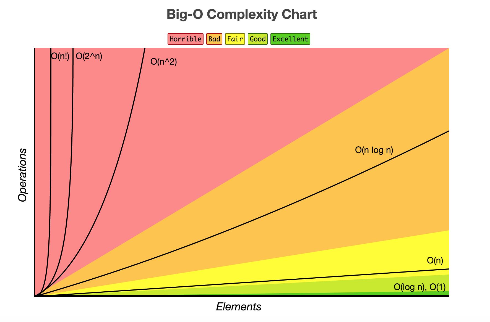

# 排序算法

### 时间复杂度

评估算法的一个维度是时间复杂度（最差、平均、和最好性能），一般而言，_O(n log n)_ 是比较好的，_O(n^2)_ 就属于比较糟糕的。

下图列举了各种事件复杂度的表现：

### 空间复杂度

用来评估算法执行过程中，对于储存资源的使用量。

### 稳定性

假如一个排序算法是稳定的，如果 a 原本在 b 前面，而 a=b，排序之后 a 仍然在 b 的前面。

### 比较类与非比较类

比较类排序：通过比较来决定元素的相对次序，比较类排序的算法至少需要 _O(n log n)_ 的时间复杂度。

非比较类排序：不通过比较来决定元素的相对次序。

### 常见算法

下表对一些常见的算法进行了比较：

参考链接：

- [Sorting Algorithms](https://frontend.turing.io/lessons/module-4/sorting-algorithms.html?ads_cmpid=6451354298&ads_adid=76255849919&ads_matchtype=b&ads_network=g&ads_creative=378056926252&utm_term=&ads_targetid=dsa-19959388920&utm_campaign=&utm_source=adwords&utm_medium=ppc&ttv=2&gclid=Cj0KCQjwiYL3BRDVARIsAF9E4GdhlXUgY18SD5-GVukVFmz08dUqgt_yrIOXEGDGd5vlvz18zdXXuYMaAvA3EALw_wcB)
- [十大经典排序算法（动图演示）](https://www.cnblogs.com/onepixel/p/7674659.html)