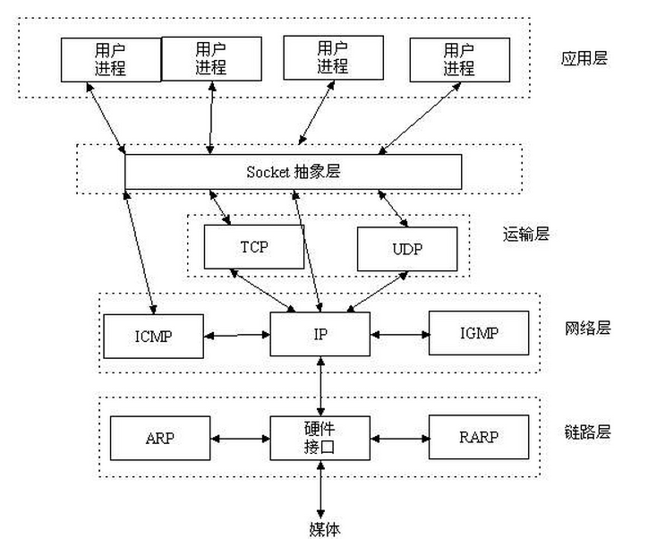
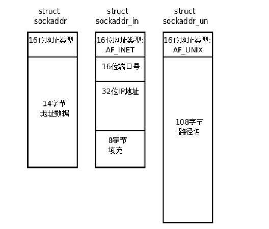

# Socket

## 1 概念

Socket 可以看做由操作系统基于 TCP/IP 封装的一套 API，它屏蔽了各个协议的通信细节，使得程序员无需关注协议本身，直接进行互联中不同主机间的进程的通信。



## 2 基本编程接口

**socket**

```c#
/*
	创建一个 socket 控制块 so_pcb 
	- protofamily 指定协议族
		- AF_INET 指定so_pcb中的地址要采用ipv4地址类型
		- AF_INET6 指定so_pcb中的地址要采用ipv6地址类型
		- AF_LOCAL/AF_UNIX 指定so_pcb中的地址要使用绝对路径名
		- ...
	- so_type 指定 socket 类型
		- SOCK_STREAM 提供有序的、可靠的、双向的和基于连接的字节流服务，当使用Internet地址族时使用TCP
		- SOCK_DGRAM 支持无连接的、不可靠的和使用固定大小（通常很小）缓冲区的数据报服务，当使用Internet地址族使用UDP
		- SOCK_RAW 原始套接字，允许对底层协议如IP或ICMP进行直接访问，可以用于自定义协议的开发
	- protocol 指定具体的协议，也就是指定本次通信能接受的数据包的类型和发送数据包的类型
		- IPPROTO_TCP TCP协议
		- IPPROTO_UDP UDP协议
		- 0 如果指定为0，表示由内核根据so_type指定默认的通信协议
*/
int socket(int protofamily, int so_type, int protocol);
```
`so_pcb`表示socket控制块，其又指向一个结构体，该结构体包含了当前主机的ip地址(`inp_laddr`)，当前主机进程的端口号(`inp_lport`)，发送端主机的ip地址(`inp_faddr`)，发送端主体进程的端口号(`inp_fport`)。`so_pcb`是socket类型的关键结构，不亚于进程控制块之于进程，在进程中，一个pcb可以表示一个进程，描述了进程的所有信息，每个进程有唯一的进程编号，该编号就对应pcb；socket也同时是这样，每个socket有一个`so_pcb`，描述了该socket的所有信息，而每个socket有一个编号，这个编号就是socket描述符。说到这里，我们发现，socket确实和进程很像，就像我们把具体的进程看成是程序的一个实例，同样我们也可以把具体的socket看成是网络通信的一个实例

**bind**

```c#
/*
	给 so_pcb 结构中的地址赋值
	- sockfd 调用socket()函数创建的socket描述符
	- addr 具体的地址
	- addrlen 地址长度
*/
int bind(int sockfd, const struct sockaddr *addr, socklen_t addrlen);
```

对于不同的地址类型，sockaddr 结构体是不一样的

```c#
// AF_INET:
struct sockaddr_in {
    sa_family_t    sin_family; /* address family: AF_INET */
    in_port_t      sin_port;   /* port in network byte order */
    struct in_addr sin_addr;   /* internet address */
};
struct in_addr {
    uint32_t       s_addr;     /* address in network byte order */
};

// AF_INET6:
struct sockaddr_in6 { 
    sa_family_t     sin6_family;   /* AF_INET6 */ 
    in_port_t       sin6_port;     /* port number */ 
    uint32_t        sin6_flowinfo; /* IPv6 flow information */ 
    struct in6_addr sin6_addr;     /* IPv6 address */ 
    uint32_t        sin6_scope_id; /* Scope ID (new in 2.4) */ 
};
struct in6_addr { 
    unsigned char   s6_addr[16];   /* IPv6 address */ 
};

// AF_UNIX:
#define UNIX_PATH_MAX    108
struct sockaddr_un { 
    sa_family_t sun_family;               /* AF_UNIX */ 
    char        sun_path[UNIX_PATH_MAX];  /* pathname */ 
};
```

sockaddr 不同，那么其长度 addrlen 也是不一样的：



**connect**

```c#
/*
	与其他端点进行连接
	- sockfd 调用socket()函数创建的socket描述符
	- addr 目的端的地址
	- addrlen 目的端地址的长度
*/
int connect(int sockfd, const struct sockaddr *addr, socklen_t addrlen);
```

connect顾名思义就是拿来建立连接的函数，只有像tcp这样面向连接、提供可靠服务的协议才需要建立连接

**listen**

```c#
/*
	启动监听并指定最大连接数
	- sockfd 调用socket()函数创建的socket描述符
	- backlog ACCEPT队列长度（已经完成三次握手而等待ACCEPT的连接数）
*/
int listen(int sockfd, int backlog)
```
在使用listen函数告知内核监听的描述符后，内核就会建立两个队列，一个**SYN队列**，表示接受到请求，但未完成三次握手的连接；另一个是**ACCEPT队列**，表示已经完成了三次握手的队列。

**accept**

```c#
/*
	从ACCEPT队列中拿一个连接，并生成一个新的描述符
	- sockfd 调用socket()函数创建的socket描述符
	- addr 传出参数 地址指针
	- addrlen 传出参数 地址长度指针
*/
int accept(int listen_sockfd, struct sockaddr *addr, socklen_t *addrlen)
```

返回的新的描述符所指向的结构体so_pcb中的请求端ip地址、请求端端口已完成初始化。

**connect、listen、accept**

以`AF_INET`,`SOCK_STREAM`,`IPPROTO_TCP`三个参数实例化的socket为例来说明他们之间的工作流程：


1. 服务器端在调用listen之后，内核会建立两个队列，SYN队列和ACCEPT队列，其中ACCPET队列的长度由backlog指定。
2. 服务器端在调用accpet之后，将阻塞，等待ACCPT队列有元素。
3. 客户端在调用connect之后，将开始发起SYN请求，请求与服务器建立连接，此时称为第一次握手。
4. 服务器端在接受到SYN请求之后，把请求方放入SYN队列中，并给客户端回复一个确认帧ACK，此帧还会携带一个请求与客户端建立连接的请求标志，也就是SYN，这称为第二次握手。
5. 客户端收到SYN+ACK帧后，connect返回，并发送确认建立连接帧ACK给服务器端。这称为第三次握手
6. 服务器端收到ACK帧后，会把请求方从SYN队列中移出，放至ACCEPT队列中，而accept函数也等到了自己的资源，从阻塞中唤醒，从ACCEPT队列中取出请求方，重新建立一个新的sockfd，并返回。

**send**

```c#
/*
	发送消息
	- flags
		- MSG_DONTWAIT 不阻塞
		- MSG_DONTROUTE 数据包不允许通过网关
		- MSG_OOB 带外数据
*/
#include <unistd.h>

ssize_t write(int fd, const void *buf, size_t count);

#include <sys/types.h>
#include <sys/socket.h>

ssize_t send(int sockfd, const void *buf, size_t len, int flags);

ssize_t sendto(int sockfd, const void *buf, size_t len, int flags,const struct sockaddr *dest_addr, socklen_t addrlen);

ssize_t sendmsg(int sockfd, const struct msghdr *msg, int flags);
```

**receive**

```c#
/*
	接收消息
*/
#include <unistd.h>

ssize_t read(int fd, void *buf, size_t count);

#include <sys/types.h>
#include <sys/socket.h>

ssize_t recv(int sockfd, void *buf, size_t len, int flags);

ssize_t recvfrom(int sockfd, void *buf, size_t len, int flags,struct sockaddr *src_addr, socklen_t *addrlen);

ssize_t recvmsg(int sockfd, struct msghdr *msg, int flags);
```

## 3 WebSocket


WebSocket 基于 HTTP，建立在 TCP 协议之上的全双工**协议**。与 HTTP 协议有着良好的兼容性。默认端口也是 80 和 443，并且握手阶段采用 HTTP 协议，因此握手时不容易屏蔽，能通过各种 HTTP 代理服务器。

协议标识符是ws（如果加密，则为wss），服务器网址就是 URL。

```js
ws://example.com:80/some/path
```


### 3.1 API

**创建实例**

```js
var ws = new WebSocket('ws://localhost:8080');
```
**连接状态**

```webSocket.readyState``` 返回实例对象当前的连接状态

- CONNECTING：值为0，表示正在连接。
- OPEN：值为1，表示连接成功，可以通信了。
- CLOSING：值为2，表示连接正在关闭。
- CLOSED：值为3，表示连接已经关闭，或者打开连接失败。

**事件监听**

on函数

```js
// 连接成功
ws.addEventListener('open', function (event) {
  ws.send('Hello Server!');
});
// 连接关闭
ws.addEventListener("close", function(event) {
  var code = event.code;
  var reason = event.reason;
  var wasClean = event.wasClean;
  // handle close event
});
// 接收到消息
ws.addEventListener("message", function(event) {
  var data = event.data;
  // 处理数据
});
// 发生错误
socket.addEventListener("error", function(event) {
  // handle error event
});
```

addEventListener 函数

```js
// 连接成功
ws.onopen = function () {
  ws.send('Hello Server!');
}
// 连接关闭
ws.onclose = function(event) {
  var code = event.code;
  var reason = event.reason;
  var wasClean = event.wasClean;
  // handle close event
};
// 接收到消息
ws.onmessage = function(event) {
  var data = event.data;
  // 处理数据
};
// 发生错误
socket.onerror = function(event) {
  // handle error event
};
```

**发送**

```js
// 文本
ws.send('your message');
// blob 对象

var file = document
  .querySelector('input[type="file"]')
  .files[0];
ws.send(file);
// ArrayBuffer
// Sending canvas ImageData as ArrayBuffer
var img = canvas_context.getImageData(0, 0, 400, 320);
var binary = new Uint8Array(img.data.length);
for (var i = 0; i < img.data.length; i++) {
  binary[i] = img.data[i];
}
ws.send(binary.buffer);
```

**webSocket.bufferedAmount**

标识还有多少字节的二进制数据没有发送出去

```js
var data = new ArrayBuffer(10000000);
socket.send(data);

if (socket.bufferedAmount === 0) {
  // 发送完毕
} else {
  // 发送还没结束
}
```

### 3.2 Socket.io

Socket.io 是基于 WebSocket 封装的框架。

在一些特性的应用场景下，我们需要实现客户端和服务器的双向通信。在 H5 之前需要使用轮询的方式来实现，浪费资源且效率低下。

HTML5 开始支持 WebSocket 协议，但是浏览器对HTML5的支持情况不同，在不支持 WebSocket 协议的情况下就需要使用 http + 轮询 来实现需求。

Socket.io 的出现就是为了解决这种状况，它封装了 WebSocket 和轮询等方法，会针对不同的平台或者浏览器的兼容情况选择恰当的方式进行处理，开发人员不必去关心具体的实现细节。

Socket.io 的服务端由 node.js 实现。

## 4 其他

### Socket 使用 tcp 和 udp 传输方式的区别：

**重传机制**

为了保证可靠性，TCP 封装了重传机制。这就造成了 TCP 和 UDP 之间在延时和可靠性上的差异。

由于重传机制的存在，当网络传输过程中丢包率偏高时，TCP 的延时会不断累积。

**延时和可靠性**

对于延时要求高，可靠性要求相对低的场景使用 UDP。比如实时音视频。

对于可靠性要求高，延时要求次之的场景使用 TCP。例如 IM 即时通讯。

**其他**

UDP 是不需要和 TCP一样在发送数据前进行三次握手建立连接的，

UDP 不止支持一对一的传输方式，同样支持一对多，多对多，多对一的方式，也就是说 UDP 提供了单播，多播，广播的功能。

tcp 面向字节流传输
udp 面向报文传输


### 通讯模式

- 单工：数据传输方向唯一，只能又发送方向接收方传输数据。
- 半双工：通信双方既是发送方也是接收方，不过在某个时刻只允许一个方向传输数据。
- 全双工：通信双方既是发送方也是接收方，可以同时发送和接收数据。

参考链接：

- [socket原理详解](https://www.cnblogs.com/zengzy/p/5107516.html)
- [WebSocket 教程](https://www.ruanyifeng.com/blog/2017/05/websocket.html)
