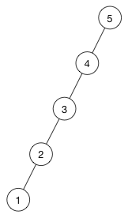
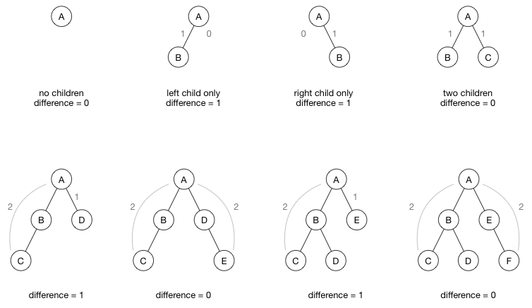
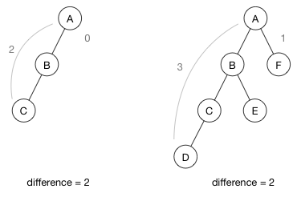
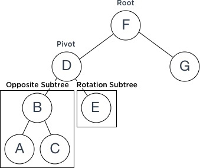
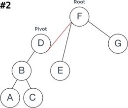

# AVL 树

AVL 树是一种自平衡二叉查找树（BST），AVL 树中子树的高度差不大于 1。

> AVL树得名于它的发明者G. M. Adelson-Velsky和Evgenii Landis。

理想情况下一棵二叉查找树的左右子树包含相同的节点数，插入、删除、查找的时间复杂度都是 O(log n)，但在极端情况下，比如所有的节点都在左子树，BST 就会退化成链表，时间复杂度为 O(n)。



AVL 树就是为了解决这个问题而产生的。在 AVL 树中，所有节点的左子树与其右子树的高度差不大于 1。如果所有节点都平衡，那么整棵树都是平衡的。

下面这些都是平衡树：



下面这些则不是：



左子树和右子树之间的高度差叫**平衡因子**，其计算公式如下：

```
balance factor = abs(height(left subtree) - height(right subtree))
```

插入和删除操作都有可能会导致树失去平衡，因此我们需要通过旋转让其再度平衡。

### 旋转

每一个节点都会维护一个变量来检测自己当前的平衡因子，因此在插入一个新的节点之后我们需要更新其父节点的平衡因子。如果平衡因子大于 1，就要对树的一部分进行旋转，以达到新的平衡。



为了进行旋转，需要知道以下术语：

- Root - 子树的父节点，它即将被旋转；
- Pivot - 支点，旋转之后它将取代 Root 的位置
- RotationSubtree - 旋转侧子树
- OppositeSubtree - 非旋转侧子树

接下来让我们看一下，要如何进行旋转才能让左右子树恢复平衡：



从图中可以看到，旋转过程大致如下：

1. 将RotationSubtree指定为Root的新OppositeSubtree
2. 将Root指定为Pivot的新RotationSubtree
3. 检查结果

用伪代码来描述其实现过程就是：

```swift
Root.OS = Pivot.RS
Pivot.RS = Root
Root = Pivot
```

这是一个常数时间操作 - O(1) 插入操作最多需要 2 次旋转。删除操作最多需要 log(n) 旋转。

### 实现代码

AVL 与 BST 的代码大多相同，不一样的地方就是 AVL 在插入和删除操作之后会进行再平衡。

```swift
public class TreeNode<Key: Comparable, Payload> {
  public typealias Node = TreeNode<Key, Payload>
  
  var payload: Payload?   // Value held by the node
  
  fileprivate var key: Key    // Node's name
  internal var leftChild: Node?
  internal var rightChild: Node?
  fileprivate var height: Int
  weak fileprivate var parent: Node?
  
  public init(key: Key, payload: Payload?, leftChild: Node?, rightChild: Node?, parent: Node?, height: Int) {
    self.key = key
    self.payload = payload
    self.leftChild = leftChild
    self.rightChild = rightChild
    self.parent = parent
    self.height = height
    
    self.leftChild?.parent = self
    self.rightChild?.parent = self
  }
  
  public convenience init(key: Key, payload: Payload?) {
    self.init(key: key, payload: payload, leftChild: nil, rightChild: nil, parent: nil, height: 1)
  }
  
  public convenience init(key: Key) {
    self.init(key: key, payload: nil)
  }
  
  var isRoot: Bool {
    return parent == nil
  }
  
  var isLeaf: Bool {
    return rightChild == nil && leftChild == nil
  }
  
  var isLeftChild: Bool {
    return parent?.leftChild === self
  }
  
  var isRightChild: Bool {
    return parent?.rightChild === self
  }
  
  var hasLeftChild: Bool {
    return leftChild != nil
  }
  
  var hasRightChild: Bool {
    return rightChild != nil
  }
  
  var hasAnyChild: Bool {
    return leftChild != nil || rightChild != nil
  }
  
  var hasBothChildren: Bool {
    return leftChild != nil && rightChild != nil
  }
}

// MARK: - The AVL tree
open class AVLTree<Key: Comparable, Payload> {
  public typealias Node = TreeNode<Key, Payload>
  
  fileprivate(set) var root: Node?
  fileprivate(set) var size = 0
  
  public init() { }
}

// MARK: - Searching
extension TreeNode {
  public func minimum() -> TreeNode? {
    return leftChild?.minimum() ?? self
  }
  
  public func maximum() -> TreeNode? {
    return rightChild?.maximum() ?? self
  }
}

extension AVLTree {
  subscript(key: Key) -> Payload? {
    get { return search(input: key) }
    set { insert(key: key, payload: newValue) }
  }
  
  public func search(input: Key) -> Payload? {
    return search(key: input, node: root)?.payload
  }
  
  fileprivate func search(key: Key, node: Node?) -> Node? {
    if let node = node {
      if key == node.key {
        return node
      } else if key < node.key {
        return search(key: key, node: node.leftChild)
      } else {
        return search(key: key, node: node.rightChild)
      }
    }
    return nil
  }
}

// MARK: - Inserting new items
extension AVLTree {
  public func insert(key: Key, payload: Payload? = nil) {
    if let root = root {
      insert(input: key, payload: payload, node: root)
    } else {
      root = Node(key: key, payload: payload)
    }
    size += 1
  }
  
  private func insert(input: Key, payload: Payload?, node: Node) {
    if input < node.key {
      if let child = node.leftChild {
        insert(input: input, payload: payload, node: child)
      } else {
        let child = Node(key: input, payload: payload, leftChild: nil, rightChild: nil, parent: node, height: 1)
        node.leftChild = child
        balance(node: child)
      }
    } else if input != node.key {
      if let child = node.rightChild {
        insert(input: input, payload: payload, node: child)
      } else {
        let child = Node(key: input, payload: payload, leftChild: nil, rightChild: nil, parent: node, height: 1)
        node.rightChild = child
        balance(node: child)
      }
    }
  }
}

// MARK: - Balancing tree
extension AVLTree {
  fileprivate func updateHeightUpwards(node: Node?) {
    if let node = node {
      let lHeight = node.leftChild?.height ?? 0
      let rHeight = node.rightChild?.height ?? 0
      node.height = max(lHeight, rHeight) + 1
      updateHeightUpwards(node: node.parent)
    }
  }
  
  fileprivate func lrDifference(node: Node?) -> Int {
    let lHeight = node?.leftChild?.height ?? 0
    let rHeight = node?.rightChild?.height ?? 0
    return lHeight - rHeight
  }
  
  fileprivate func balance(node: Node?) {
    guard let node = node else {
      return
    }
    
    updateHeightUpwards(node: node.leftChild)
    updateHeightUpwards(node: node.rightChild)
    
    var nodes = [Node?](repeating: nil, count: 3)
    var subtrees = [Node?](repeating: nil, count: 4)
    let nodeParent = node.parent
    
    let lrFactor = lrDifference(node: node)
    if lrFactor > 1 {
      // left-left or left-right
      if lrDifference(node: node.leftChild) > 0 {
        // left-left
        nodes[0] = node
        nodes[2] = node.leftChild
        nodes[1] = nodes[2]?.leftChild
        
        subtrees[0] = nodes[1]?.leftChild
        subtrees[1] = nodes[1]?.rightChild
        subtrees[2] = nodes[2]?.rightChild
        subtrees[3] = nodes[0]?.rightChild
      } else {
        // left-right
        nodes[0] = node
        nodes[1] = node.leftChild
        nodes[2] = nodes[1]?.rightChild
        
        subtrees[0] = nodes[1]?.leftChild
        subtrees[1] = nodes[2]?.leftChild
        subtrees[2] = nodes[2]?.rightChild
        subtrees[3] = nodes[0]?.rightChild
      }
    } else if lrFactor < -1 {
      // right-left or right-right
      if lrDifference(node: node.rightChild) < 0 {
        // right-right
        nodes[1] = node
        nodes[2] = node.rightChild
        nodes[0] = nodes[2]?.rightChild
        
        subtrees[0] = nodes[1]?.leftChild
        subtrees[1] = nodes[2]?.leftChild
        subtrees[2] = nodes[0]?.leftChild
        subtrees[3] = nodes[0]?.rightChild
      } else {
        // right-left
        nodes[1] = node
        nodes[0] = node.rightChild
        nodes[2] = nodes[0]?.leftChild
        
        subtrees[0] = nodes[1]?.leftChild
        subtrees[1] = nodes[2]?.leftChild
        subtrees[2] = nodes[2]?.rightChild
        subtrees[3] = nodes[0]?.rightChild
      }
    } else {
      // Don't need to balance 'node', go for parent
      balance(node: node.parent)
      return
    }
    
    // nodes[2] is always the head
    
    if node.isRoot {
      root = nodes[2]
      root?.parent = nil
    } else if node.isLeftChild {
      nodeParent?.leftChild = nodes[2]
      nodes[2]?.parent = nodeParent
    } else if node.isRightChild {
      nodeParent?.rightChild = nodes[2]
      nodes[2]?.parent = nodeParent
    }
    
    nodes[2]?.leftChild = nodes[1]
    nodes[1]?.parent = nodes[2]
    nodes[2]?.rightChild = nodes[0]
    nodes[0]?.parent = nodes[2]
    
    nodes[1]?.leftChild = subtrees[0]
    subtrees[0]?.parent = nodes[1]
    nodes[1]?.rightChild = subtrees[1]
    subtrees[1]?.parent = nodes[1]
    
    nodes[0]?.leftChild = subtrees[2]
    subtrees[2]?.parent = nodes[0]
    nodes[0]?.rightChild = subtrees[3]
    subtrees[3]?.parent = nodes[0]
    
    updateHeightUpwards(node: nodes[1])    // Update height from left
    updateHeightUpwards(node: nodes[0])    // Update height from right
    
    balance(node: nodes[2]?.parent)
  }
}

// MARK: - Displaying tree
extension AVLTree {
  fileprivate func display(node: Node?, level: Int) {
    if let node = node {
      display(node: node.rightChild, level: level + 1)
      print("")
      if node.isRoot {
        print("Root -> ", terminator: "")
      }
      for _ in 0..<level {
        print("        ", terminator:  "")
      }
      print("(\(node.key):\(node.height))", terminator: "")
      display(node: node.leftChild, level: level + 1)
    }
  }
  
  public func display(node: Node) {
    display(node: node, level: 0)
    print("")
  }
  
  public func inorder(node: Node?) -> String {
    var output = ""
    if let node = node {
      output = "\(inorder(node: node.leftChild)) \(print("\(node.key) ")) \(inorder(node: node.rightChild))"
    }
    return output
  }
  
  public func preorder(node: Node?) -> String {
    var output = ""
    if let node = node {
      output = "\(preorder(node: node.leftChild)) \(print("\(node.key) ")) \(preorder(node: node.rightChild))"
    }
    return output
  }
  
  public func postorder(node: Node?) -> String {
    var output = ""
    if let node = node {
      output = "\(postorder(node: node.leftChild)) \(print("\(node.key) ")) \(postorder(node: node.rightChild))"
    }
    return output
  }
}

// MARK: - Delete node
extension AVLTree {
  public func delete(key: Key) {
    if size == 1 {
      root = nil
      size -= 1
    } else if let node = search(key: key, node: root) {
      delete(node: node)
      size -= 1
    }
  }
  
  private func delete(node: Node) {
    if node.isLeaf {
      // Just remove and balance up
      if let parent = node.parent {
        guard node.isLeftChild || node.isRightChild else {
          // just in case
          fatalError("Error: tree is invalid.")
        }
        
        if node.isLeftChild {
          parent.leftChild = nil
        } else if node.isRightChild {
          parent.rightChild = nil
        }
        
        balance(node: parent)
      } else {
        // at root
        root = nil
      }
    } else {
      // Handle stem cases
      if let replacement = node.leftChild?.maximum(), replacement !== node {
        node.key = replacement.key
        node.payload = replacement.payload
        delete(node: replacement)
      } else if let replacement = node.rightChild?.minimum(), replacement !== node {
        node.key = replacement.key
        node.payload = replacement.payload
        delete(node: replacement)
      }
    }
  }
}

// MARK: - Advanced Stuff
extension AVLTree {
  public func doInOrder(node: Node?, _ completion: (Node) -> Void) {
    if let node = node {
      doInOrder(node: node.leftChild) { lnode in
        completion(lnode)
      }
      completion(node)
      doInOrder(node: node.rightChild) { rnode in
        completion(rnode)
      }
    }
  }
  
  public func doInPreOrder(node: Node?, _ completion: (Node) -> Void) {
    if let node = node {
      completion(node)
      doInPreOrder(node: node.leftChild) { lnode in
        completion(lnode)
      }
      doInPreOrder(node: node.rightChild) { rnode in
        completion(rnode)
      }
    }
  }
  
  public func doInPostOrder(node: Node?, _ completion: (Node) -> Void) {
    if let node = node {
      doInPostOrder(node: node.leftChild) { lnode in
        completion(lnode)
      }
      doInPostOrder(node: node.rightChild) { rnode in
        completion(rnode)
      }
      completion(node)
    }
  }
}

// MARK: - Debugging
extension TreeNode: CustomDebugStringConvertible {
  public var debugDescription: String {
    var s = "key: \(key), payload: \(payload), height: \(height)"
    if let parent = parent {
      s += ", parent: \(parent.key)"
    }
    if let left = leftChild {
      s += ", left = [" + left.debugDescription + "]"
    }
    if let right = rightChild {
      s += ", right = [" + right.debugDescription + "]"
    }
    return s
  }
}

extension AVLTree: CustomDebugStringConvertible {
  public var debugDescription: String {
    return root?.debugDescription ?? "[]"
  }
}

extension TreeNode: CustomStringConvertible {
  public var description: String {
    var s = ""
    if let left = leftChild {
      s += "(\(left.description)) <- "
    }
    s += "\(key)"
    if let right = rightChild {
      s += " -> (\(right.description))"
    }
    return s
  }
}

extension AVLTree: CustomStringConvertible {
  public var description: String {
    return root?.description ?? "[]"
  }
}
```


参考链接：

- [https://github.com/raywenderlich/swift-algorithm-club/tree/master/AVL%20Tree](https://github.com/raywenderlich/swift-algorithm-club/tree/master/AVL%20Tree)
- [https://github.com/andyRon/swift-algorithm-club-cn/tree/master/AVL%20Tree](https://github.com/andyRon/swift-algorithm-club-cn/tree/master/AVL%20Tree)

