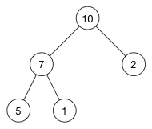
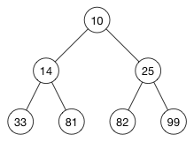

# 堆

堆（Heap）是一种特殊的二叉树。按照特性可以分为最大堆（max-heap）和最小堆（min-heap）两种。

在最大堆中，父节点的值永远要大于子节点，而最小堆恰恰相反。

比如下图就是一个最大堆：



由于堆的这种特性，最大堆根节点永远储存着这棵树中的最大值，而最小值有可能储存在任何一个叶子中。


堆中元素排列按照从上到下，从左到右的规则。只有当前层的所有节点都被填满才会向下一层添加元素。

二叉树通常将所有数据保存在一个数组，通过一定规则的算法来实现节点的索引和其它操作。


### 堆和二叉搜索树

我们可以通过和二叉搜索树（BST）的比较来帮助理解：

- 节点顺序。BST 左孩子永远小于父节点，右孩子永远大于父节点；而 Heap 只要求孩子节点小于（max-heap）或大于（min-heap）父节点
- 储存空间。由于数据结构原因其他树需要申请额外的储存空间来保存各个节点数据（包括原始值，左右孩子的指针等）；而 heap 只用数组实现数据储存
- 搜索。BST 被设计为进行搜索的所以其搜索性能更好，而 Heap 被设计成存取最大最小值时有更快。

### 堆和数组

堆是由数组实现的，按照从上到下、从左到右的顺序，其节点的值依次被保存在一个数组中。根据堆得性质，根据一个节点的 index 可以推断出其父节点和孩子节点的索引：

```swift
// 假设 i 是某个节点的索引
parent(i) = floor((i - 1)/2)
left(i)   = 2i + 1
right(i)  = 2i + 2
```

> 注意：right(i) 只是简单的 left(i) + 1

堆中的数组可以看做是一个按一定规则排序的特殊数组。

堆中节点的索引是计算得来，而不需要保存指针。这样虽然节省了空间，但会花费额外的计算，所幸这些计算的时间复杂度都是 O(1)。

下图可以更直观地看到节点位置和其索引的关系：


现在让我们来看一个数组：

```swift
[ 10, 14, 25, 33, 81, 82, 99 ]
```

Q：这个数组是一个堆吗？

A：当然是！我们可以把它画出来看一下：



分析之后，我们可以得出一个结论：

**所有有序数组都可以表达为一个堆。**

> 值得注意的是，堆按照索引排列却不一定是有序数组，需要按照堆排序算法运算才能转换成有序数组。

### 一些数学关系

树的高度（height）代表从 root 节点到最底层节点需要走过的步数。一个 _h_ 高的堆拥有 _h + 1_ 层节点：


**包含 _n_ 个节点的堆的高度 _h = floor(log2(n))_ 。** 

这是因为在进行下一层之前总是需要将当前层填满。例如有 15 个节点的堆，其高度为 `floor(log2(15)) = floor(3.91) = 3`。

**如果最底层被填满，那么该层就有 _2^h_ 个节点， 剩余的节点一共包含 _2^h - 1_ 个节点。**

例如途中的堆，最底层被填满，且高度是3，那么盖层一共有 _2^3 = 8_ 个节点，前三层一共包含 _2^3 - 1 = 7_ 个节点。

**高度为 _h_ 的堆的节点总数是 _n = 2^(h+1) - 1_ 。**

例如高度是 3 的堆，其节点总数 _n = 2^(3+1) -1 = 15_ 。

**叶子节点索引总是在 _[floor(n/2), n-1]_ 这个区间。**

例如 有 15 个节点的堆，其叶子索引为 _[floor(15/2) = 7, 15-1 = 14]_。

### 操作

堆所有操作都建立在两个非常重要的基础操作之上：

- `shiftUp()` 如果一个节点的值大于（max-heap）或小于（min-heap）它的父节点，那么就需要将它们两个进行交换。这使得该元素向上移动。
- `shiftDown()` 如果一个节点的值小于（max-heap）或大于（min-heap）它的孩子节点，那么就需要将它们两个进行交换。这使得该元素向下移动。

上移和下移都是递归操作，其时间复杂度是 O(log n)。

下面是堆得一些主要操作：

- `insert(value)`： 将新元素添加到堆得最末端，然后使用 `shiftUp()` 函数修正元素位置。
- `remove()`：删除并返回最大值（max-heap）或者最小值（min-heap），将末端元素放在最顶端，然后使用 `shiftDown)` 函数修正元素位置。
- `removeAtIndex(index)`：这个方法让你可以删除堆中的任何元素，同样的，将末端元素放在被删除的位置，然后使用 `shiftUp()` 或 `shiftDown()` 来修正元素位置。
- `replace(index, value)`：先使用 `removeAtIndex(index)` 删除指定元素，然后在使用 `insert(value)` 插入，进行两次 O(log n) 操作。或者也可以将新的元素放在被删除节点，然后使用 `shiftUp()` 或者 `shiftDown()` 进行一次 O(log n) 操作。

以上所有操作的时间复杂度都是 O(log n)。然而还有其他操作需要花费更久的时间：

- `search(value)`：堆并不擅长搜索，但 `replace()` 和 `removeAtIndex()` 操作需要知道节点的索引，因此你需要使用 `search()` 方法来找到它，时间复杂度是 O(n) 。
- `buildHeap(array)`：通过重复调用 `insert()` 将一个未排序的数组转换成堆。如果你仔细研究一下就可以将这个操作优化到 O(n) 的时间复杂度。
- 堆排序。由于堆是一个数组，因此你可以根据其特性将数组排序，时间复杂度是 O(n lg n）。

### 实现代码

由于堆有两种类型：max-heap 和 min-heap，它们唯一的区别就是大小顺序不同。我们可以充分利用这个特性，创建一个通用的堆，使用闭包来决定其排序依据。 类似于 Swift 的 `sort()` 方法：

```swift
// 创建 Int 类型的 max-heap 
var maxHeap = Heap<Int>(sort: >)
// 创建 Int 类型的 min-heap 
var minHeap = Heap<Int>(sort: <)
```

下面就是完整的实现代码，可以对比前面提到的那些内容来仔细分析一下：

```swift
//
//  Heap.swift
//  Written for the Swift Algorithm Club by Kevin Randrup and Matthijs Hollemans
//
public struct Heap<T> {
  
  /** The array that stores the heap's nodes. */
  var nodes = [T]()
  
  /**
   * Determines how to compare two nodes in the heap.
   * Use '>' for a max-heap or '<' for a min-heap,
   * or provide a comparing method if the heap is made
   * of custom elements, for example tuples.
   */
  private var orderCriteria: (T, T) -> Bool
  
  /**
   * Creates an empty heap.
   * The sort function determines whether this is a min-heap or max-heap.
   * For comparable data types, > makes a max-heap, < makes a min-heap.
   */
  public init(sort: @escaping (T, T) -> Bool) {
    self.orderCriteria = sort
  }
  
  /**
   * Creates a heap from an array. The order of the array does not matter;
   * the elements are inserted into the heap in the order determined by the
   * sort function. For comparable data types, '>' makes a max-heap,
   * '<' makes a min-heap.
   */
  public init(array: [T], sort: @escaping (T, T) -> Bool) {
    self.orderCriteria = sort
    configureHeap(from: array)
  }
  
  /**
   * Configures the max-heap or min-heap from an array, in a bottom-up manner.
   * Performance: This runs pretty much in O(n).
   */
  private mutating func configureHeap(from array: [T]) {
    nodes = array
    for i in stride(from: (nodes.count/2-1), through: 0, by: -1) {
      shiftDown(i)
    }
  }
  
  public var isEmpty: Bool {
    return nodes.isEmpty
  }
  
  public var count: Int {
    return nodes.count
  }
  
  /**
   * Returns the index of the parent of the element at index i.
   * The element at index 0 is the root of the tree and has no parent.
   */
  @inline(__always) internal func parentIndex(ofIndex i: Int) -> Int {
    return (i - 1) / 2
  }
  
  /**
   * Returns the index of the left child of the element at index i.
   * Note that this index can be greater than the heap size, in which case
   * there is no left child.
   */
  @inline(__always) internal func leftChildIndex(ofIndex i: Int) -> Int {
    return 2*i + 1
  }
  
  /**
   * Returns the index of the right child of the element at index i.
   * Note that this index can be greater than the heap size, in which case
   * there is no right child.
   */
  @inline(__always) internal func rightChildIndex(ofIndex i: Int) -> Int {
    return 2*i + 2
  }
  
  /**
   * Returns the maximum value in the heap (for a max-heap) or the minimum
   * value (for a min-heap).
   */
  public func peek() -> T? {
    return nodes.first
  }
  
  /**
   * Adds a new value to the heap. This reorders the heap so that the max-heap
   * or min-heap property still holds. Performance: O(log n).
   */
  public mutating func insert(_ value: T) {
    nodes.append(value)
    shiftUp(nodes.count - 1)
  }
  
  /**
   * Adds a sequence of values to the heap. This reorders the heap so that
   * the max-heap or min-heap property still holds. Performance: O(log n).
   */
  public mutating func insert<S: Sequence>(_ sequence: S) where S.Iterator.Element == T {
    for value in sequence {
      insert(value)
    }
  }
  
  /**
   * Allows you to change an element. This reorders the heap so that
   * the max-heap or min-heap property still holds.
   */
  public mutating func replace(index i: Int, value: T) {
    guard i < nodes.count else { return }
    
    remove(at: i)
    insert(value)
  }
  
  /**
   * Removes the root node from the heap. For a max-heap, this is the maximum
   * value; for a min-heap it is the minimum value. Performance: O(log n).
   */
  @discardableResult public mutating func remove() -> T? {
    guard !nodes.isEmpty else { return nil }
    
    if nodes.count == 1 {
      return nodes.removeLast()
    } else {
      // Use the last node to replace the first one, then fix the heap by
      // shifting this new first node into its proper position.
      let value = nodes[0]
      nodes[0] = nodes.removeLast()
      shiftDown(0)
      return value
    }
  }
  
  /**
   * Removes an arbitrary node from the heap. Performance: O(log n).
   * Note that you need to know the node's index.
   */
  @discardableResult public mutating func remove(at index: Int) -> T? {
    guard index < nodes.count else { return nil }
    
    let size = nodes.count - 1
    if index != size {
      nodes.swapAt(index, size)
      shiftDown(from: index, until: size)
      shiftUp(index)
    }
    return nodes.removeLast()
  }
  
  /**
   * Takes a child node and looks at its parents; if a parent is not larger
   * (max-heap) or not smaller (min-heap) than the child, we exchange them.
   */
  internal mutating func shiftUp(_ index: Int) {
    var childIndex = index
    let child = nodes[childIndex]
    var parentIndex = self.parentIndex(ofIndex: childIndex)
    
    while childIndex > 0 && orderCriteria(child, nodes[parentIndex]) {
      nodes[childIndex] = nodes[parentIndex]
      childIndex = parentIndex
      parentIndex = self.parentIndex(ofIndex: childIndex)
    }
    
    nodes[childIndex] = child
  }
  
  /**
   * Looks at a parent node and makes sure it is still larger (max-heap) or
   * smaller (min-heap) than its childeren.
   */
  internal mutating func shiftDown(from index: Int, until endIndex: Int) {
    let leftChildIndex = self.leftChildIndex(ofIndex: index)
    let rightChildIndex = leftChildIndex + 1
    
    // Figure out which comes first if we order them by the sort function:
    // the parent, the left child, or the right child. If the parent comes
    // first, we're done. If not, that element is out-of-place and we make
    // it "float down" the tree until the heap property is restored.
    var first = index
    if leftChildIndex < endIndex && orderCriteria(nodes[leftChildIndex], nodes[first]) {
      first = leftChildIndex
    }
    if rightChildIndex < endIndex && orderCriteria(nodes[rightChildIndex], nodes[first]) {
      first = rightChildIndex
    }
    if first == index { return }
    
    nodes.swapAt(index, first)
    shiftDown(from: first, until: endIndex)
  }
  
  internal mutating func shiftDown(_ index: Int) {
    shiftDown(from: index, until: nodes.count)
  }
  
}

// MARK: - Searching
extension Heap where T: Equatable {
  
  /** Get the index of a node in the heap. Performance: O(n). */
  public func index(of node: T) -> Int? {
    return nodes.index(where: { $0 == node })
  }
  
  /** Removes the first occurrence of a node from the heap. Performance: O(n). */
  @discardableResult public mutating func remove(node: T) -> T? {
    if let index = index(of: node) {
      return remove(at: index)
    }
    return nil
  }
  
}
```


参考链接：

- [https://github.com/raywenderlich/swift-algorithm-club/tree/master/Heap](https://github.com/raywenderlich/swift-algorithm-club/tree/master/Heap)
- [Swift Algorithm Club: Heap and Priority Queue Data Structure](https://www.raywenderlich.com/586-swift-algorithm-club-heap-and-priority-queue-data-structure)