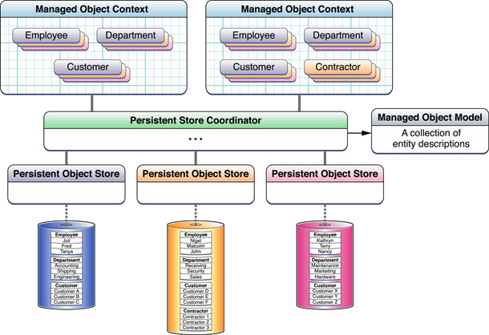

# CoreData

CoreData 是基于 ORM（Object-Relation-Mapping）的数据持久化框架。

> ORM（Object-Relation-Mapping）：对象关系映射，就是把对象的属性和表中的字段自动映射

CoreData 的核心元素如下：

- **store** 数据实际储存的文件
- **scheme** 数据实体的属性以及相互间的关系
- **context** 数据操作的执行环境
- **obj** 数据对象
- **coordinator** 管理 store

它们对应的抽象类如下：

```
1. store - NSPersistentStore
代表储存文件的抽象类，文件是SQLite、XML、Binary等类型。

2. scheme - NSManagedObjectModel
代表实体及实体关系的描述文件的抽象类， 即`example.xcdatamodeld`文件，而此文件最终会被编译为 `example.momd`

3. context - NSManagedObjectContext 
操作数据对象的上下文环境

4. obj - NSManagedObject
数据对象

5. coordinator - NSPersistentStoreCoordinator
- 关联 store 和 scheme
- 整合多个 store 并向 context 提供通用的接口
```

下图可以帮助我们更好地理解个元素之间的关系：



这就是 Core Data 的整个架构。其他所有东西都在围绕着这个核心进行扩展。

参考链接：

- [https://developer.apple.com/library/archive/documentation/DataManagement/Devpedia-CoreData/coreDataOverview.html](https://developer.apple.com/library/archive/documentation/DataManagement/Devpedia-CoreData/coreDataOverview.html)

