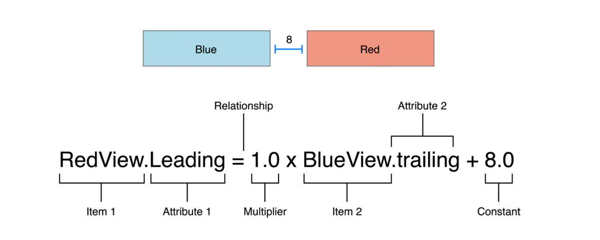

# AutoLayout

AutoLayout 是基于**参照**和**约束**建立的一套布局方案。其核心是一个线性方程求解引擎。

## 实现原理



在 AutoLayout 内部，每个 `NSLayoutConstraint` 实例都被转换成一个线性方程：

```swift
item1.attribute1 = multiplier × item2.attribute2 + constant
```
比如定义两个 button 之间的相对位置，你可以描述为：“第二个按钮的头部距离第一个按钮的尾部8个像素单位”，此描述在 AutoLayout 中的提现就是：

```swift
// positive values move to the right in left-to-right languages like English.
button2.leading = 1.0 × button1.trailing + 8.0
```

使用 AutoLayout 解析的时候，就是对约束产生的**线性方程组**进行求解，确定每个组件的 `attributes`，然后计算出组件的位置和大小，最终使用 frame 渲染在屏幕上。

如果方程组有且只有一组解，那么描述他们的 layout 就是**合理的**。如果方程组求解的到多种解，那么此 layout 就是**有歧义的**。如果方程组没有解，那么这组 layout 就有**冲突**。

### NSLayoutConstraint

`NSLayoutConstraint` 描述了两个 UI 对象之间的约束关系。它可以通过以下便利构造器创建：

```swift
/*
 - view1 和 view2 代表两个 UI 对象实例
 - attr1 和 attr2 确定两个 UI 对象的约束类型
 - relation 用来描述 attr1 和 attr2 之间的关系 相等/小于等于/大于等于
 - multiplier 和 constant 明确了方程中的乘数和常量
 */
@available(iOS 6.0, *)
public convenience init(item view1: Any, attribute attr1: NSLayoutConstraint.Attribute, relatedBy relation: NSLayoutConstraint.Relation, toItem view2: Any?, attribute attr2: NSLayoutConstraint.Attribute, multiplier: CGFloat, constant c: CGFloat)
```


### NSLayoutConstraint.Attribute

约束的类型

```swift
public enum Attribute : Int {
    
    case left = 1

    case right = 2

    case top = 3

    case bottom = 4

    case leading = 5

    case trailing = 6

    case width = 7

    case height = 8

    case centerX = 9

    case centerY = 10

    case lastBaseline = 11

    
    @available(iOS 8.0, *)
    case firstBaseline = 12

    
    @available(iOS 8.0, *)
    case leftMargin = 13

    @available(iOS 8.0, *)
    case rightMargin = 14

    @available(iOS 8.0, *)
    case topMargin = 15

    @available(iOS 8.0, *)
    case bottomMargin = 16

    @available(iOS 8.0, *)
    case leadingMargin = 17

    @available(iOS 8.0, *)
    case trailingMargin = 18

    @available(iOS 8.0, *)
    case centerXWithinMargins = 19

    @available(iOS 8.0, *)
    case centerYWithinMargins = 20

    
    case notAnAttribute = 0
}

```

### NSLayoutConstraint.Relation

两个 attribute 之间的关系并不一定是一个确定的值。`NSLayoutConstraint.Relation` 就是用来描述这种不确定的关系。

```swift
public enum Relation : Int {

    case lessThanOrEqual = -1
    
    case equal = 0
    
    case greaterThanOrEqual = 1
}

```

### UILayoutPriority

每个 `NSLayoutConstraint` 都有一个 `priority: NSLayoutConstraint`  属性，用来描述此约束的优先级。

```swift
public struct UILayoutPriority : Hashable, Equatable, RawRepresentable {

    public init(_ rawValue: Float)

    public init(rawValue: Float)
}

```

这个权重的值是 1 ~ 1000 之间，1000 代表这个约束是 `required` 的，其他值都表示此约束为 `optional`。系统提供了一些默认的权重值：

```swift
extension UILayoutPriority {

    @available(iOS 6.0, *)
    public static let required: UILayoutPriority

    @available(iOS 6.0, *)
    public static let defaultHigh: UILayoutPriority // This is the priority level with which a button resists compressing its content.

    public static let dragThatCanResizeScene: UILayoutPriority // This is the appropriate priority level for a drag that may end up resizing the window's scene.

    public static let sceneSizeStayPut: UILayoutPriority // This is the priority level at which the window's scene prefers to stay the same size.  It's generally not appropriate to make a constraint at exactly this priority. You want to be higher or lower.

    public static let dragThatCannotResizeScene: UILayoutPriority // This is the priority level at which a split view divider, say, is dragged.  It won't resize the window's scene.

    @available(iOS 6.0, *)
    public static let defaultLow: UILayoutPriority // This is the priority level at which a button hugs its contents horizontally.

    @available(iOS 6.0, *)
    public static let fittingSizeLevel: UILayoutPriority // When you send -[UIView systemLayoutSizeFittingSize:], the size fitting most closely to the target size (the argument) is computed.  UILayoutPriorityFittingSizeLevel is the priority level with which the view wants to conform to the target size in that computation.  It's quite low.  It is generally not appropriate to make a constraint at exactly this priority.  You want to be higher or lower.
}
```

如果没有明确定义一个约束的权重，系统默认将其定义为 `required` （priority = 1,000）。

在求解方程组时，AutoLayout 会优先处理 require 级别的约束，然后根据权重由高到低进行处理。如果一个 optional 级别的约束不能被求解（即约束冲突发生），则会返回一个与期望值相近的结果，然后处理下一个约束。

约束的类型、权重、相互间的关系以及求解策略，为程序员提供了更加灵活自由的布局实现。

## 实现方案


### NSLayoutConstraint
### VFL
### Interface Builder
### AutoLayout Anchors

```swift
let margins = view.layoutMarginsGuide

view.addSubview(closeBtn)
closeBtn.translatesAutoresizingMaskIntoConstraints = false
NSLayoutConstraint.activate([
    closeBtn.topAnchor.constraint(equalTo: margins.topAnchor, constant: 5),
    closeBtn.rightAnchor.constraint(equalTo: margins.rightAnchor),
    closeBtn.heightAnchor.constraint(equalToConstant: 40)
])
```

### Masonry/SnapKit


## 其他

### 性能

由于 AutoLayout 比传统的 frame 布局多了一步求解线性方程组计算 frame 的环节，所以其性能会受到约束数量的影响，当一个页面中布局非常复杂的时候，这种影响就会显现出来。

> iOS12 的 Auto Layout 更加完善的利用了Cassowary算法的更新策略，使得AutoLayout已经基本拥有手写布局相同的性能

### 动画

因为布局约束就是要脱离frame这种表达方式的，可是动画是需要根据这个来执行，这里面就会有些矛盾，不过根据前面说到的布局约束的原理，在某个时刻约束也是会被还原成frame使视图显示，这个时刻可以通过layoutIfNeeded这个方法来进行控制。

```swift
UIView.animate(withDuration: 1) {
    containerView.layoutIfNeeded()
}
```

参考链接：

- [https://developer.apple.com/documentation/uikit/nslayoutconstraint](https://developer.apple.com/documentation/uikit/nslayoutconstraint)
- [iOS自动布局AutoLayout](https://www.jianshu.com/p/4ae8457d14b0)
