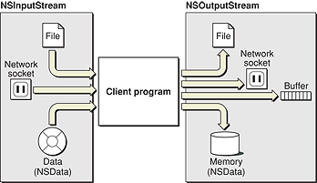

# Streams

## 概述
Streams 代表一组连续且有序的比特序列，用于两点之间的数据通信。Cocoa 提供了 3 个类型来表示流，分别是`Stream`/`InputStream`/`OutputStream`。你可以使用他们对文件或者内存进行读写，而无需一次性加载全部内容，也可以用于在 socket 连接中跟远端主机进行通讯。

**Stream**

Stream 定义了 Stream Object 的基本接口和属性。

**InputStream** 

InputStream 是 Stream 的子类，用于从文件，内存或者 socket 连接中读取数据。

**OutputStream** 

OutputStream 是 Stream 的子类，用于将数据写入文件，内存，Buffer 或者 socket。




Cocoa 的 `Stream` 是基于 Core Foundation 的 `CFStream` 构建的。他们的不同在于处理异步事件时 Cocoa 使用代理模式，而 Core Foundation 使用回调模式。他们之间如此紧密的关系，为我们代码中混编提供了便利，但要不要搞混了。

> Core Foundation 是苹果封装的一套 C 语言 API 。

## 读取数据

从 InputStream 中读取数据：

1. 从源数据实例化一个 InputStream
2. 设置其代理，并在代理方法中编写事件处理代码
3. 将 steam 对象分配给 run loop 调度
4. 打开 stream 对象
5. 读取完毕之后关闭 stream 对象

> InputStream 也被用于从 socket 中读取数据，其源数据的初始化方法稍有不同，在后文中进行介绍。

```swift
class Reader: NSObject {
    private var inputStream: InputStream?
    private let maxReadLength: Int = 10

    func read(from data: Data) {
        // 1 - 初始化
        inputStream = InputStream(data: data)
        // 2 - 设置代理
        inputStream?.delegate = self
        // 3 - 加入 run loop
        inputStream?.schedule(in: .current, forMode: .default)
        // 4 - 打开 stream
        inputStream?.open()
    }
}

extension Reader: StreamDelegate {
    func stream(_ aStream: Stream, handle eventCode: Stream.Event) {
        // 2 - 进行事件处理
        switch eventCode {
        case .hasBytesAvailable:
            // 处理数据
            let buffer = UnsafeMutablePointer<UInt8>.allocate(capacity: maxReadLength)
            let numberOfBytesRead = (aStream as! InputStream).read(buffer, maxLength: maxReadLength)
            if numberOfBytesRead > 0 {
                let string = String(bytesNoCopy: buffer, length: numberOfBytesRead, encoding: .utf8, freeWhenDone: true)
                print(string ?? "nothing read")
            } else {
                print("no buffer")
            }
        case .endEncountered:
            // 5 - 关闭 stream
            inputStream?.close()
            inputStream?.remove(from: .current, forMode: .common)
            inputStream = nil
        default:
            break
        }
    }
}
```

## 写入数据

通过 OutputStream 向文件写入数据：

1. 根据目标对象实例化一个 OutputStream
2. 设置其代理，并在代理方法中编写事件处理代码
3. 将 steam 对象分配给 run loop 调度
4. 打开 stream 对象
5. 向 OutputStream 写入数据
5. 写入完毕之后关闭 stream 对象

向 OutputStream 写入数据：

```swift
_ = sourceData.withUnsafeBytes { (rawBufferPointer: UnsafeRawBufferPointer) -> Int in
    guard let outputStream = outputStream,
        let bufferPointer = rawBufferPointer.bindMemory(to: UInt8.self).baseAddress else {
        return -1
    }
    return outputStream.write(bufferPointer, maxLength: maxWriteLength)
}
```

如果目标对象是 Memory，可以通过 NSStreamDataWrittenToMemoryStreamKey  取出写入内存的数据：

```swift
guard let data = outputStream.property(forKey: .dataWrittenToMemoryStreamKey) as? Data else { return }
let string = String(data: data, encoding: .utf8)
```

完整代码：

```swift
class Writer: NSObject {
    private var outputStream: OutputStream?
    private var target: Data?
    private var source: Data?
    private let maxWriteLength: Int = 10

    func write(to target: Data, with source: Data) {
        self.target = target
        self.source = source

        // 1 - 初始化 stream
        outputStream = OutputStream(toMemory: ())
        // 2 - 设置代理
        outputStream?.delegate = self
        // 3 - 添加到 run loop
        outputStream?.schedule(in: .current, forMode: .common)
        // 4 - 打开 stream
        outputStream?.open()
    }
}

extension Writer: StreamDelegate {
    func stream(_ aStream: Stream, handle eventCode: Stream.Event) {
        // 2 - 处理事件
        switch eventCode {
        case .hasSpaceAvailable:
            // 5 - 向 stream 写入数据
            writeBytesToStream()
        default:
            // handle other case
            break
        }
    }

    private func writeBytesToStream() {
        guard source != nil, source!.count > 0 else {
            // 6 - 写入完成关闭 stream
            outputStream?.close()
            outputStream?.remove(from: .current, forMode: .common)
            outputStream = nil
            return
        }

        let dropLength = min(source!.count, maxWriteLength)
        _ = source!.withUnsafeBytes { (rawBufferPointer: UnsafeRawBufferPointer) -> Int in
            guard let outputStream = outputStream,
                let bufferPointer = rawBufferPointer.bindMemory(to: UInt8.self).baseAddress else {
                return -1
            }
            return outputStream.write(bufferPointer, maxLength: dropLength)
        }
        source = source!.dropFirst(dropLength)
    }
}
```

## Socket Streams

Stream 也可以跟 Socket 配合使用，建立起跟远端主机之间的 socket 通信。

值得注意的是，Cocoa 提供的 `Stream` 类并不支持这样做，但是 Core Foundation 提供了 `CFStream` 的 socket 实现。基于此，我们可以通过他们两个混合使用来完成这个任务。

Socket Streams 跟文件读写的重要区别在于 input-stream 和 output-stream 的初始化过程以及 output-stream 的写入时机。

```swift
class SocketStreamManager: NSObject {
    // 1
    var inputStream: InputStream?
    var outputStream: OutputStream?
    
    /// 建立会话
    func setupNetworkCommunication() {
        // 1
        var readStream: Unmanaged<CFReadStream>?
        var writeStream: Unmanaged<CFWriteStream>?
        
        // 2
        CFStreamCreatePairWithSocketToHost(kCFAllocatorDefault,
                                           "localhost" as CFString,
                                           80,
                                           &readStream,
                                           &writeStream)
        
        inputStream = readStream!.takeRetainedValue()
        outputStream = writeStream!.takeRetainedValue()
        
        //
        inputStream?.delegate = self
        
        inputStream?.schedule(in: .current, forMode: .common)
        outputStream?.schedule(in: .current, forMode: .common)
        
        inputStream?.open()
        outputStream?.open()
    }
    
    /// 发送消息
    func send(message: String) {
        guard let data = message.data(using: .utf8) else { return }
        
        _ = data.withUnsafeBytes {
            guard let pointer = $0.baseAddress?.assumingMemoryBound(to: UInt8.self) else {
                print("Error joining chat")
                return
            }
            outputStream?.write(pointer, maxLength: data.count)
        }
    }
    
    /// 停止会话
    func stopChatSession() {
        inputStream?.close()
        inputStream?.remove(from: .current, forMode: .common)
        inputStream = nil
        
        outputStream?.close()
        outputStream?.remove(from: .current, forMode: .common)
        outputStream = nil
    }
}

extension SocketStreamManager: StreamDelegate {
    func stream(_ aStream: Stream, handle eventCode: Stream.Event) {
        switch eventCode {
        case .hasBytesAvailable:
            // 处理引用
            break
        case .endEncountered:
            stopChatSession()
        default:
            // handle other cases
            break
        }
    }
}
```


TODO: 
Stream.Event


参考链接：

- [Introduction to Stream Programming Guide for Cocoa](https://developer.apple.com/library/archive/documentation/Cocoa/Conceptual/Streams/Streams.html#//apple_ref/doc/uid/10000188-SW1)
- [https://www.raywenderlich.com/3437391-real-time-communication-with-streams-tutorial-for-ios](https://www.raywenderlich.com/3437391-real-time-communication-with-streams-tutorial-for-ios)