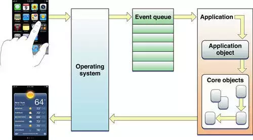
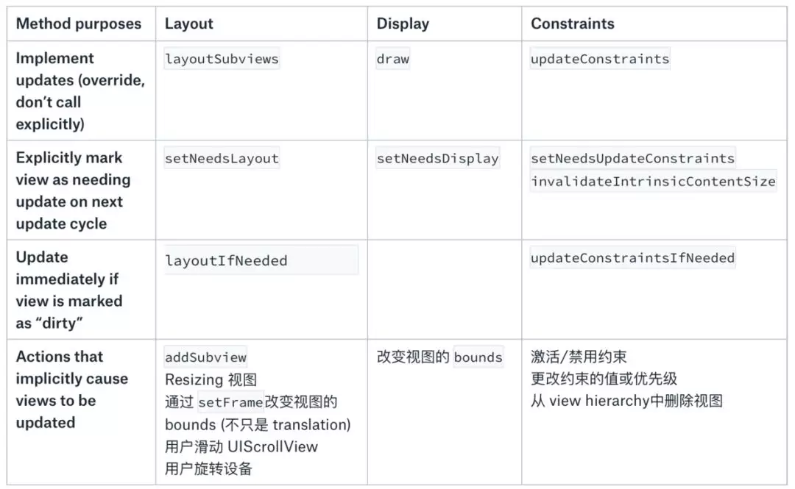
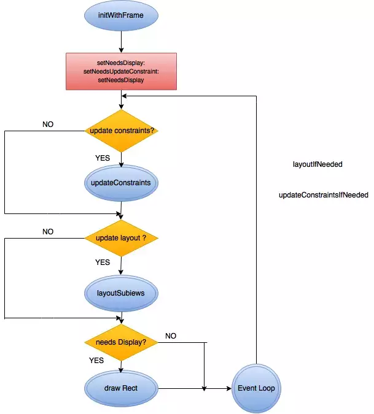

# iOS 布局

转自: [Cocoa开发者社区：揭秘 iOS 布局](https://mp.weixin.qq.com/s/ScbJCSpu8I4_jyZfUIe6fQ)

在你刚开始开发 iOS 应用时，最难避免或者是调试的就是和布局相关的问题。通常这种问题发生的原因就是对于 view 何时真正更新的错误理解。想理解 view 在何时是如何更新的，需要对 iOS run loop 和相关的 UIView 方法有深刻的理解。这篇文章会介绍这些关联，希望能帮你澄清如何用 UIView 的方法来获得正确的行为。

## 一个 iOS 应用的主 Run loop

一个 iOS 应用的主 Run loop 负责处理所有的用户输入事件并触发相应的响应。所有的用户交互都会被加入到一个事件队列中。下图中的 Application object 会从队列中取出事件并将它们分发到应用中的其他对象上。本质上它会解释这些来自用户的输入事件，然后调用在应用中的 Core objects 相应的处理代码，而这些代码再调用开发者写的代码。当这些方法调用返回后，控制流回到主 Run loop 上，然后开始 update cycle（更新周期）。Update cycle 负责布局并且重新渲染 view 们（接下来会讲到）。下面的图展示了应用是如何和设备交互并且处理用户输入的。



## Update Cycle

Update cycle 是当应用完成了你的所有事件处理代码后控制流回到主 Run loop 时的那个时间点。正是在这个时间点上系统开始更新布局、显示和设置约束。如果你在处理事件的代码中请求修改了一个 view，那么系统就会把这个 view 标记为需要重画（redraw）。在接下来的 Update cycle 中，系统就会执行这些 view 上的更改。用户交互和布局更新间的延迟几乎不会被用户察觉到。iOS 应用一般以 60 fps 的速度展示动画，就是说每个更新周期只需要 1/60 秒。这个更新的过程很快，所以用户在和应用交互时感觉不到 UI 中的更新延迟。但是由于在处理事件和对应 view 重画间存在着一个间隔，run loop 中的某时刻的 view 更新可能不是你想要的那样。如果你的代码中的某些计算依赖于当下的 view 内容或者是布局，那么就有在过时 view 信息上操作的风险。理解 run loop、update cycle 和 UIView 中具体的方法可以帮助避免或者可以调试这类问题。下面的图展示出了 update cycle 发生在 run loop 的尾部。

## 布局

一个视图的布局指的是它在屏幕上的的大小和位置。每个 view 都有一个 frame 属性，用来表示在父 view 坐标系中的位置和具体的大小。UIView 给你提供了用来通知系统某个 view 布局发生变化的方法，也提供了在 view 布局重新计算后调用的可重写的方法。

### layoutSubviews()

这个 UIView 方法处理对视图（view）及其所有子视图（subview）的重新定位和大小调整。它负责给出当前 view 和每个子 view 的位置和大小。这个方法很昂贵，因为它会在每个子视图上起作用并且调用它们相应的 layoutSubviews 方法。系统会在任何它需要重新计算视图的 frame 的时候调用这个方法，所以你应该在需要更新 frame 来重新定位或更改大小时重载它。然而你不应该在代码中显式调用这个方法。相反，有许多可以在 run loop 的不同时间点触发 layoutSubviews 调用的机制，这些触发机制比直接调用 layoutSubviews 的资源消耗要小得多。

当 layoutSubviews 完成后，在 view 的所有者 view controller 上，会触发 viewDidLayoutSubviews 调用。因为 viewDidLayoutSubviews 是 view 布局更新后会被唯一可靠调用的方法，所以你应该把所有依赖于布局或者大小的代码放在 viewDidLayoutSubviews 中，而不是放在 viewDidLoad 或者 viewDidAppear 中。这是避免使用过时的布局或者位置变量的唯一方法。

### 自动刷新触发器

有许多事件会自动给视图打上 “update layout”标记，因此 layoutSubviews 会在下一个周期中被调用，而不需要开发者手动操作。这些自动通知系统 view 的布局发生变化的方式有：

- 修改 view 的大小
- 新增子 view
- 用户在 UIScrollView 上滚动（layoutSubviews 会在 UIScrollView 和它的父 view 上被调用）
- 用户旋转设备
- 更新视图的 constraints

这些方式都会告知系统 view 的位置需要被重新计算，继而会自动转化为一个最终的 layoutSubviews 调用。当然，也有直接触发 layoutSubviews 的方法。

### setNeedsLayout()

触发 layoutSubviews 调用的最省资源的方法就是在你的视图上调用 setNeedsLaylout 方法。调用这个方法代表向系统表示视图的布局需要重新计算。setNeedsLaylout 方法会立刻执行并返回，但在返回前不会真正更新视图。视图会在下一个 update cycle 中更新，就在系统调用视图们的 layoutSubviews 以及他们的所有子视图的 layoutSubviews 方法的时候。即使从 setNeedsLayout 返回后到视图被重新绘制并布局之间有一段任意时间的间隔，但是这个延迟不会对用户造成影响，因为永远不会长到对界面造成卡顿。

### layoutIfNeeded()

layoutIfNeeded 是另一个会让 UIView 触发 layoutSubviews 的方法。 当视图需要更新的时候，与 setNeedsLayout() 会让视图在下一周期调用 layoutSubviews 更新视图不同，layoutIfNeeded 会立即调用 layoutSubviews 方法。但是如果你调用了 layoutIfNeeded 之后，并且没有任何操作向系统表明需要刷新视图，那么就不会调用 layoutsubview。如果你在同一个 run loop 内调用两次 layoutIfNeeded，并且两次之间没有更新视图，第二个调用同样不会触发 layoutSubviews 方法。

使用 layoutIfNeeded，则布局和重绘会立即发生并在函数返回之前完成（除非有正在运行中的动画）。这个方法在你需要依赖新布局，无法等到下一次 update cycle 的时候会比 setNeedsLayout 有用。除非是这种情况，否则你更应该使用 setNeedsLayout，这样在每次 run loop 中都只会更新一次布局。

当对希望通过修改 constraint 进行动画时，这个方法特别有用。你需要在 animation block 之前调用 layoutIfNeeded，以确保在动画开始之前传播所有的布局更新。在 animation block 中设置新 constrait 后，需要再次调用 layoutIfNeeded 来动画到新的状态。

## 显示

一个视图的显示包含了颜色、文本、图片和 Core Graphics 绘制等视图属性，不包括其本身和子视图的大小和位置。和布局的方法类似，显示也有触发更新的方法，它们由系统在检测到更新时被自动调用，或者我们可以手动调用直接刷新。

### draw(_:)

UIView 的 draw 方法（本文使用 Swift，对应 Objective-C 的 drawRect）方法对视图内容显示的操作，类似于视图布局的 layoutSubviews ，但是不同于 layoutSubviews，draw 方法不会触发后续对视图的子视图方法的调用。同样，和 layoutSubviews 一样，你不应该直接调用 draw 方法，而应该通过调用触发方法，让系统在 run loop 中的不同结点自动调用。

### setNeedsDisplay()

这个方法类似于布局中的 setNeedsLayout 。它会给有内容更新的视图设置一个内部的标记，但在视图重绘之前就会返回。然后在下一个 update cycle 中，系统会遍历所有已标标记的视图，并调用它们的draw 方法。如果你只想在下次更新时重绘部分视图，你可以调用 setNeedsDisplay(_:)，并把需要重绘的矩形部分传进去（setNeedsDisplayInRect in OC)。大部分时候，在视图中更新任何 UI 组件都会把相应的视图标记为“dirty”，通过设置视图“内部更新标记”，在下一次 update cycle 中就会重绘，而不需要显式的 setNeedsDisplay 调用。然而如果你有一个属性没有绑定到 UI 组件，但需要在每次更新时重绘视图，你可以定义他的 didSet 属性，并且调用 setNeedsDisplay 来触发视图合适的更新。

有时候设置一个属性要求自定义绘制，这种情况下你需要重写 draw 方法。在下面的例子中，设置 numberOfPoints 会触发系统系统根据具体点数绘制视图。在这个例子中，你需要在 draw 方法中实现自定义绘制，并在 numberOfPoints 的 property observer 里调用 setNeedsDisplay。

```swift
class MyView: UIView {
    var numberOfPoints = 0 {
        didSet {
            setNeedsDisplay()
        }
    }

    override func draw(_ rect: CGRect) {
        switch numberOfPoints {
        case 0:
            return
        case 1:
            drawPoint(rect)
        case 2:
            drawLine(rect)
        case 3:
            drawTriangle(rect)
        case 4:
            drawRectangle(rect)
        case 5:
            drawPentagon(rect)
        default:
            drawEllipse(rect)
        }
    }
}
```

视图的显示方法里没有类似布局中的 layoutIfNeeded 这样可以触发立即更新的方法。通常情况下等到下一个更新周期再重新绘制视图也无所谓。

## 约束

自动布局包含三步来布局和重绘视图。第一步是更新约束，系统会计算并给视图设置所有要求的约束。第二步是布局阶段，布局引擎计算视图和子视图的 frame 并且将它们布局。最后一步完成这一循环的是显示阶段，重绘视图的内容，如实现了 draw 方法则调用 draw。

### updateConstraints()

这个方法用来在自动布局中动态改变视图约束。和布局中的 layoutSubviews() 方法或者显示中的 draw 方法类似，updateConstraints() 只应该被重载，绝不要在代码中显式地调用。通常你只应该在 updateConstraints 方法中实现必须要更新的约束。静态的约束应该在 interface builder、视图的初始化方法或者 viewDidLoad() 方法中指定。

通常情况下，开启或者关闭 constrains、更改 constrain 的属性或者常量值、或者从视图层级中移除一个视图时都会设置一个内部的标记，这个标记会在下一个更新周期中触发调用 updateConstrains。当然，也有手动给视图打上“update constarints” 标记的方法，如下。

### setNeedsUpdateConstraints()

调用 setNeedsUpdateConstraints() 会保证在下一次更新周期中更新约束。它通过标记“ constrant 已 update”来触发 updateConstraints()。这个方法和 setNeedsDisplay() 以及 setNeedsLayout() 方法的工作机制类似。

### updateConstraintsIfNeeded()

对于使用自动布局的视图来说，这个方法与 layoutIfNeeded 等价。它会检查“更新 constrains”标记（可以被 setNeedsUpdateConstraints 自动设置，或者 invalidateInstrinsicContentSize）。如果它认为这些约束需要被更新，它会立即触发 updateConstraints() ，而不会等到 run loop 的末尾。

### invalidateIntrinsicContentSize()

自动布局中某些视图拥有 intrinsicContentSize 属性，这是视图根据它的内容得到的自然尺寸。一个视图的 intrinsicContentSize 通常由所包含的元素的约束决定，但也可以通过重载提供自定义行为。调用 invalidateIntrinsicContentSize() 会设置一个标记表示这个视图的 intrinsicContentSize 已经过期，需要在下一个布局阶段重新计算。

## 它们是如何连接起来的

布局、显示和约束都遵循着相似的模式，例如他们更新的方式以及如何在 run loop 的不同时间点上强制更新。任意组件都有一个实际去更新的方法（layoutSubviews, draw, 和 updateConstraints），你可以重写来手动操作视图，但是任何情况下都不要显式调用。这个方法只在run loop的末端会被调用，如果视图被标记了告诉系统该视图需要被更新的标记的话。有一些操作会自动设置这个标志，但是也有一些方法允许您显式地设置它。对于布局和约束相关的更新，如果你等不到在run loop末端才更新（例如：其他行为依赖于新布局），有方法可以让你立即更新，并保证“布局需更新”标记被正确标记。下面的表格列出了任意组件会怎样更新及其对应方法。



下面的流程图总结了 update cycle 和 event loop 之间的交互，并指出了上文提到的方法在 run loop 运行期间的位置。你可以在run loop中的任意一点显示的调用 layoutIfNeeded 或者 updateConstraintsIfNeeded，需要记住，这开销会很大。在循环的末端是 update cycle，如果视图被设置了特定的“update constraints,” “update layout,”或者 “needs display”标记，在这节点会更新约束、布局以及展示。一旦这些更新结束，runloop会重新启动。


