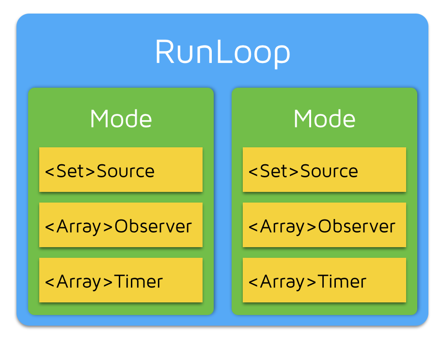

# RunLoop

RunLoop 是基于 **EventLoop** 模型，通过对 **事件/消息** 的管理， 使**线程**在相应时机完成指定动作的**对象**。

它能以很小的开销维持线程常驻。

### 模式
- defaut
- common
- UITracking
- 程序初始化模式
- 系统内核模式


```C
function loop() {
    do {
        var message = get_next_message();
        process_message(message);
    } while (message != quit);
}
```


线程和 RunLoop 是一一对应的，其关系是保存在一个全局的 `Dictionary` 里。`key` 是 `pthread_t`， `value` 是 `CFRunLoopRef`。线程刚创建时并没有 RunLoop，如果你不主动获取，那它一直都不会有。RunLoop 的创建是发生在第一次获取时，RunLoop 的销毁是发生在线程结束时。你只能在一个线程的内部获取其 RunLoop（主线程除外）。

RunLoop 可以保持线程不被销毁，但不占用系统资源。

- `CFRunLoopRef` 是在 `CoreFoundation` 框架内的，它提供了纯 C 函数的 API，所有这些 API 都是线程安全的。
- `NSRunLoop` 是基于 `CFRunLoopRef` 的封装，提供了面向对象的 API，但是这些 API 不是线程安全的。

RunLoop 接收消息/事件，
接收消息 -> 等待 -> 处理


## 1 几个重要的类型

在 CoreFoundation 里面关于 RunLoop 有5个类:

- CFRunLoopRef
- CFRunLoopModeRef
- CFRunLoopSourceRef
- CFRunLoopTimerRef
- CFRunLoopObserverRef

其中 CFRunLoopModeRef 类并没有对外暴露，只是通过 CFRunLoopRef 的接口进行了封装。他们的关系如下:



一个 `RunLoop` 包含若干个 `Mode`，每个 `Mode` 又包含若干个 `Source/Timer/Observer`。每次调用 `RunLoop` 的主函数时，只能指定其中一个 `Mode`，这个`Mode`被称作 `CurrentMode`。

### CFRunloop

CFRunLoopMode 和 CFRunLoop 的结构大致如下：

```C
struct __CFRunLoopMode {
    CFStringRef _name;            // Mode Name, 例如 @"kCFRunLoopDefaultMode"
    CFMutableSetRef _sources0;    // Set
    CFMutableSetRef _sources1;    // Set
    CFMutableArrayRef _observers; // Array
    CFMutableArrayRef _timers;    // Array
    ...
};
 
struct __CFRunLoop {
    CFMutableSetRef _commonModes;     // Set
    CFMutableSetRef _commonModeItems; // Set<Source/Observer/Timer>
    CFRunLoopModeRef _currentMode;    // Current Runloop Mode
    CFMutableSetRef _modes;           // Set
    ...
};
```

### CFRunLoopSourceRef

是事件产生的地方。`Source`有两个版本：`Source0` 和 `Source1`。

- `Source0` 只包含了一个回调（函数指针），它并不能主动触发事件。使用时，你需要先调用 `CFRunLoopSourceSignal(source)`，将这个 Source 标记为待处理，然后手动调用 `CFRunLoopWakeUp(runloop)` 来唤醒 RunLoop，让其处理这个事件。
- `Source1` 包含了一个 `mach_port` 和一个回调（函数指针），被用于通过内核和其他线程相互发送消息。这种 `Source` 能主动唤醒 `RunLoop` 的线程，其原理在下面会讲到。

### CFRunLoopTimerRef

`CFRunLoopTimerRef` 是基于时间的触发器，它和 `NSTimer` 是`toll-free bridged` 的，可以混用。其包含一个时间长度和一个回调（函数指针）。当其加入到 `RunLoop` 时，`RunLoop`会注册对应的时间点，当时间点到时，`RunLoop` 会被唤醒以执行那个回调。


### CFRunLoopObserverRef

`CFRunLoopObserverRef` 是观察者，每个 `Observer` 都包含了一个回调（函数指针），当 `RunLoop` 的状态发生变化时，观察者就能通过回调接受到这个变化。可以观测的时间点有以下几个：

```C
typedef CF_OPTIONS(CFOptionFlags, CFRunLoopActivity) {
    kCFRunLoopEntry         = (1UL << 0), // 即将进入Loop
    kCFRunLoopBeforeTimers  = (1UL << 1), // 即将处理 Timer
    kCFRunLoopBeforeSources = (1UL << 2), // 即将处理 Source
    kCFRunLoopBeforeWaiting = (1UL << 5), // 即将进入休眠
    kCFRunLoopAfterWaiting  = (1UL << 6), // 刚从休眠中唤醒
    kCFRunLoopExit          = (1UL << 7), // 即将退出Loop
};
```

> 上面的 `Source/Timer/Observer` 被统称为 `mode item`，一个 `item` 可以被同时加入多个 `mode`。但一个 `item` 被重复加入同一个 `mode` 时是不会有效果的。如果一个 `mode` 中一个 `item` 都没有，则 `RunLoop` 会直接退出，不进入循环。


## 2 实现过程

## 3 应用场景

- 维持线程常驻
- 主线程耗时操作分段完成解决卡顿

分析 [CoreFoundation/RunLoop/CFRunLoop.h](https://github.com/apple/swift-corelibs-foundation/blob/master/CoreFoundation/RunLoop.subproj/CFRunLoop.h) 文件可以看到一下几个实体：

```c
/* Reasons for CFRunLoopRunInMode() to Return */
typedef CF_ENUM(SInt32, CFRunLoopRunResult) {
    kCFRunLoopRunFinished = 1,
    kCFRunLoopRunStopped = 2,
    kCFRunLoopRunTimedOut = 3,
    kCFRunLoopRunHandledSource = 4
};

/* Run Loop Observer Activities */
typedef CF_OPTIONS(CFOptionFlags, CFRunLoopActivity) {
    kCFRunLoopEntry = (1UL << 0),
    kCFRunLoopBeforeTimers = (1UL << 1),
    kCFRunLoopBeforeSources = (1UL << 2),
    kCFRunLoopBeforeWaiting = (1UL << 5),
    kCFRunLoopAfterWaiting = (1UL << 6),
    kCFRunLoopExit = (1UL << 7),
    kCFRunLoopAllActivities = 0x0FFFFFFFU
};
```


```swift

public struct CFRunLoopMode : Hashable, Equatable, RawRepresentable {

    public init(_ rawValue: CFString)

    public init(rawValue: CFString)
}

public class CFRunLoop {
}

public class CFRunLoopSource {
}

public class CFRunLoopObserver {
}

public class CFRunLoopTimer {
}

/* Reasons for CFRunLoopRunInMode() to Return */
public enum CFRunLoopRunResult : Int32 {

    
    case finished

    case stopped

    case timedOut

    case handledSource
}
```

## 参考链接
[深入理解RunLoop](https://blog.ibireme.com/2015/05/18/runloop/)

