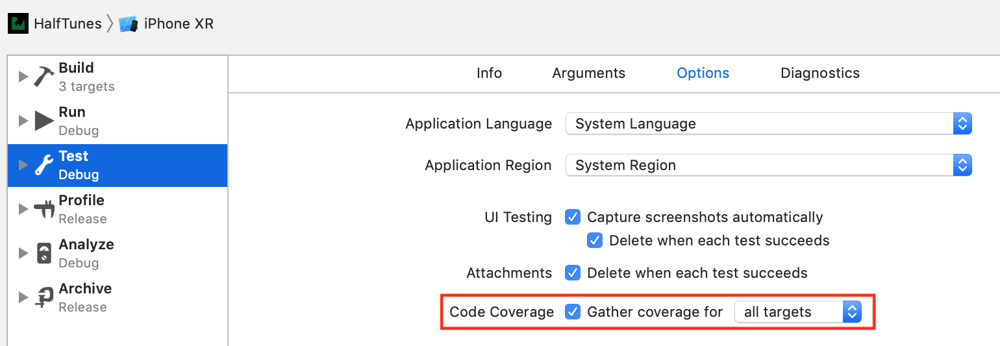
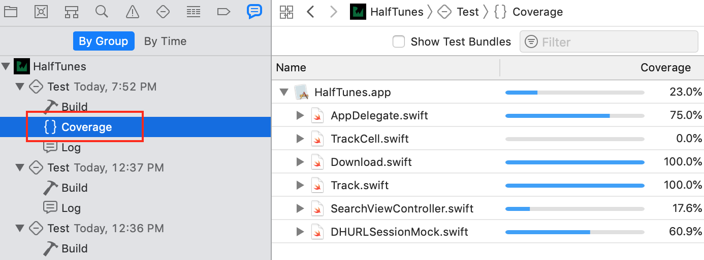

# 单元测试

## 1 基本概念

### 1.1 什么是单元测试

Unit Testing 又称模块测试，单元测试是指对软件中的最小可测试单元进行检查和验证。

### 1.2 单元测试有什么好处

- 质量。通过单元测试，可以保证代码的行为和结果符合我们预期。
- 可维护性。可以放心修改、重构业务代码，只要保证每次修改都能通过测试。
- 可扩展性，降低模块耦合度。
- 帮助反思模块划分的合理性。

### 1.3 哪里需要进行单元测试

- 模块基本功能
- 最基本的 UI 操作流
- 边界条件
- Bug 修复

### 1.4 单元测试的基本原则 FIRST

- Fast：测试的运行速度要快。
- Independent / Isolated：一个测试不应当依赖于另一个测试，不依赖外部环境。
- Repeatable：同一个测试，每次都应当获得相同的结果。
- Self-validating：测试应当是完全自动化的，输出结果要么是 pass 要么是 fail，而不是依靠程序员对日志文件的解释。
- Timely：理想情况下，测试的编写，应当在编写要测试的产品代码之前。

### 1.5 其他

**完备性**

同样一个方法，要写多个测试用例，确保每一种，每一条路径都执行到，特别是边界值。另外 Bugfix 也需要补上对应的 case。确保验证通过。另外，确保一个 case 只测试一种情况。可能我们调用的一个 API 内部有一个 if…else…。建议 if 一个case，else 一个 case。分两个不同的 case 来作测试，这样每个 case 就很清晰自己在测试什么东西。当然，如果存在大量的 if…else…，那就要考虑下代码设计上，是否存在问题了。

**自下而上**

从最基础的 Base 层，往上写测试。确保基础的 Model，Manager 测试通过，才开始为 Controller 编写测试，因为这部分业务是最复杂的，也是最容易改变的。

## 2 编写单元测试

### 2.1 Unit Testing

**创建单元测试 Target**


**运行单元测试**

有三种方法运行单元测试：

- Product > Test 或者 Command-U。运行全部单元测试用例。
- 在左侧的测试导航栏中点击运行按钮
- 在代码编辑器的行数编号处点击运行按钮


**编码**

在 import 语句下面，导入项目模块，以便测试用例可以访问项目中的 `internal` 级别的类型和函数。

```swift
@testable import BullsEye
```

在 `BullsEyeTests ` 类的最上方添加一个属性，作为被测目标 `BullsEyeGame` 的占位符。

```swift
var sut: BullsEyeGame!
```

>  System Under Test (SUT) - 被测系统

在 `setUp()` 函数中对被测系统进行初始化

```swift
sut = BullsEyeGame()
sut.startNewGame()
```

在 `tearDown() `函数中释放被测系统实例

```swift
sut = nil
super.tearDown()
```

> 在 `setUp()` 函数中创建SUT，在 `tearDown()` 函数中销毁。这样可以保证当前测试用例运行完成之后状态重置。参考[Most Swift Folks Are Wrong about XCTestCase tearDown…](https://qualitycoding.org/xctestcase-teardown/)

编写测试代码块

```swift
func testScoreIsComputed() {
  // 1. given
  let guess = sut.targetValue + 5

  // 2. when
  sut.check(guess: guess)

  // 3. then
  XCTAssertEqual(sut.scoreRound, 95, "Score computed from guess is wrong")
}
```

> 测试用例可以根据以下三步进行编写：
> 
> - Given：配置测试的初始状态
> - When：对要测试的目标执行代码
> - Then：对测试结果进行断言（成功 or 失败）

添加 `Test Failure` 断点，对测试用例进行 Debug


使用 `XCTestExpectation` 进行异步操作测试

```swift
// Asynchronous test: success fast, failure slow
func testValidCallToiTunesGetsHTTPStatusCode200() {
  // given
  let url = 
    URL(string: "https://itunes.apple.com/search?media=music&entity=song&term=abba")
  // 1
  let promise = expectation(description: "Status code: 200")

  // when
  let dataTask = sut.dataTask(with: url!) { data, response, error in
    // then
    if let error = error {
      XCTFail("Error: \(error.localizedDescription)")
      return
    } else if let statusCode = (response as? HTTPURLResponse)?.statusCode {
      if statusCode == 200 {
        // 2
        promise.fulfill()
      } else {
        XCTFail("Status code: \(statusCode)")
      }
    }
  }
  dataTask.resume()
  // 3
  wait(for: [promise], timeout: 5)
}
```

> - expectation(description:): 返回了一个 `XCTestExpectation` 实例，描述中填写预期行为。
> - promise.fulfill(): 在异步任务执行成功时调用，用来通知测试用例执行成功。
> - wait(for:timeout:): 保证测试用例一直在运行，直到所有 `expectations` 都 fullfill，或者执行超时。

要想尽快得到异步执行结果可以进行如下优化

```swift
func testCallToiTunesCompletes() {
  // given
  let url = 
    URL(string: "https://itune.apple.com/search?media=music&entity=song&term=abba")
  let promise = expectation(description: "Completion handler invoked")
  var statusCode: Int?
  var responseError: Error?

  // when
  let dataTask = sut.dataTask(with: url!) { data, response, error in
    statusCode = (response as? HTTPURLResponse)?.statusCode
    responseError = error
    promise.fulfill()
  }
  dataTask.resume()
  wait(for: [promise], timeout: 5)

  // then
  XCTAssertNil(responseError)
  XCTAssertEqual(statusCode, 200)
}
```

> 异步操作结束之后直接返回，然后再对结果进行判断


### 2.2 UI Testing

创建 `UI Test Target`

在类的最顶层创建属性

```swift
var app: XCUIApplication!
```

在 `setUp()` 函数中初始化

```swift
app = XCUIApplication()
app.launch()
```

编写测试函数 `testGameStyleSwitch() `，在函数中添加一个空白行，点击代码编辑器下方工具栏中的记录按钮。


Xcode 会在模拟器中打开 APP，此时进行需要测试的操作，你的操作将会被转换为一系列的操作命令，并在测试函数中自动生成代码，如下：

```swift
let app = XCUIApplication()
app.buttons["Slide"].tap()
app.staticTexts["Get as close as you can to: "].tap()
```

编辑生成的代码，留下需要的测试对象。

```swift
// given
let slideButton = app.segmentedControls.buttons["Slide"]
let typeButton = app.segmentedControls.buttons["Type"]
let slideLabel = app.staticTexts["Get as close as you can to: "]
let typeLabel = app.staticTexts["Guess where the slider is: "]
```

编写测试断言

```swift
// then
if slideButton.isSelected {
  XCTAssertTrue(slideLabel.exists)
  XCTAssertFalse(typeLabel.exists)

  typeButton.tap()
  XCTAssertTrue(typeLabel.exists)
  XCTAssertFalse(slideLabel.exists)
} else if typeButton.isSelected {
  XCTAssertTrue(typeLabel.exists)
  XCTAssertFalse(slideLabel.exists)

  slideButton.tap()
  XCTAssertTrue(slideLabel.exists)
  XCTAssertFalse(typeLabel.exists)
}
```
> 这个测试用例可以验证当点击了某个按钮的时候，是否切换到了相应的标签。


### 2.3 Performance Testing

性能测试很简单，只需要在测试函数中的 `measure` 闭包中编写测试代码。测试程序会自动执行10次并取得平均值。

```swift
func test_StartDownload_Performance() {
  let track = Track(
    name: "Waterloo", 
    artist: "ABBA",
    previewUrl: 
      "http://a821.phobos.apple.com/us/r30/Music/d7/ba/ce/mzm.vsyjlsff.aac.p.m4a")

  measure {
    self.sut.startDownload(track)
  }
}
```

点击 `measuer` 函数左侧的小方块，可以查看测量信息，并设置 baseline，进行代码修改或者重构之后可以对新的数据和 baseline 进行比较，查看结果。`Edit` 按钮可用将新的测量数据应用为 baseline。

### 2.4 Code Coverage

代码覆盖率工具可以帮助你清楚地看到程序中的哪些代码已经（或者还未）完成单元测试。

在 Scheme 编辑栏中可以打开代码覆盖率工具。



使用 Command + U 完成所有测试之后，可以在报告导航栏 Command + 9 中查看测试覆盖率。



## 3 持续集成和自动发布

命令行运行

## 其他

### 单元测试的两种思想

**测试驱动开发（Test-driven development，TDD）**

是一种软件开发过程中的应用方法，由极限编程中倡导，以其倡导先写测试程序，然后编码实现其功能得名。测试驱动开发是戴两顶帽子思考的开发方式：先戴上实现功能的帽子，在测试的辅助下，快速实现其功能；再戴上重构的帽子，在测试的保护下，通过去除冗余的代码，提高代码质量。测试驱动着整个开发过程：首先，驱动代码的设计和功能的实现；其后，驱动代码的再设计和重构。

**行为驱动开发（Behavior-driven development，BDD）**

是一种敏捷软件开发的技术，BDD的重点是通过与利益相关者的讨论取得对预期的软件行为的清醒认识。它通过用自然语言书写非程序员可读的测试用例扩展了 测试驱动开发方法(TDD)。这让开发者得以把精力集中在代码应该怎么写，而不是技术细节上，而且也最大程度的减少了将代码编写者的技术语言与商业客户、用户、利益相关者、项目管理者等的领域语言之间来回翻译的代价。

在iOS单元测试框架中，[Kiwi](https://github.com/kiwi-bdd/Kiwi) 是BDD的代表


参考链接：

- [iOS Unit Testing and UI Testing Tutorial](https://www.raywenderlich.com/960290-ios-unit-testing-and-ui-testing-tutorial)
- [iOS 单元测试](https://colin1994.github.io/2017/08/31/iOS-Unit-Testing/)
- [初探 iOS 单元测试](https://juejin.im/post/5a3090f2f265da4310485d01)
