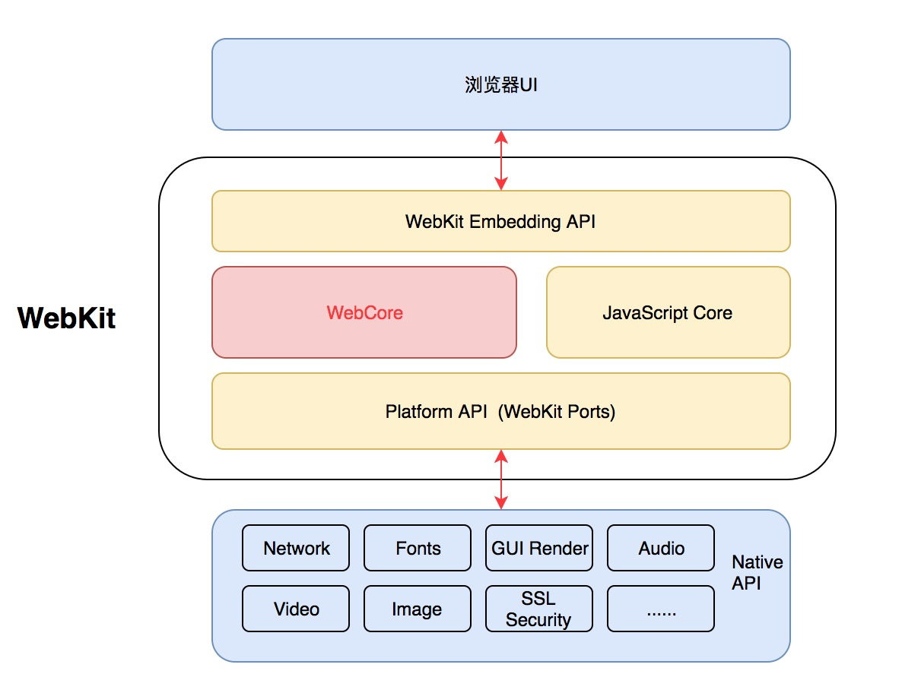

# JavaScriptCoreFramework

## 1. JSCore 和 JSCore 框架

JavaScriptCore 是 WebKit 中的重要组成模块。主要负责 JS 脚本的解释和执行。它主要由一下几个部分组成：

- Lexer 词法分析器，将脚本源码分解成一系列的Token，这一过程也叫分词（有的编译器或者解释器把分词叫做 Scanner）。
- Parser 语法分析器，处理Token并生成相应的语法树（AST）
- ByteCodeGenerator，根据 AST 来生成 JSCore 的字节码，完成整个语法解析步骤。
- LLInt 低级解释器，执行 ByteCodeGenerator 生成的二进制代码
- Baseline JIT 基线JIT（just in time 实施编译）
- DFG 低延迟优化的JIT
- FTL 高通量优化的JIT



**而 JavaScriptCore Framework 则是由 JavaScriptCore 抽象出来，用于 JS 和 OC 对象交互的框架。**

## 2. JSCore框架中的几个概念

JSContext，JSValue，JSManagedValue，JSExport， JSVirtualMachine

### 1.1 JSContext

JSContext 是 JS 的执行环境。
它提供了以下功能：

- 在 原生代码中执行 JavaScript 脚本
- 获取 JavaScript脚本 中的 对象和值
- 将原生代码中的对象/方法/函数 注册到 JavaScript 执行环境中


#### 1.1.1 执行 JS 代码

- 调用evaluateScript函数可以执行一段top-level 的JS代码，并可向global对象添加函数和对象定义
- 其返回值是JavaScript代码中最后一个生成的值

```swift
// 初始化一个 JSContext
public init!()

// 从指定 JSVirtualMachine 中初始化一个 JSContext
public init!(virtualMachine: JSVirtualMachine!)

// 执行 JS 代码，并返回代码中最后一个生成的对象
open func evaluateScript(_ script: String!) -> JSValue!

// 执行一段 JS 代码并将 sourceURL 标记为其源 URL （不会改变 JS 代码的执行，常用于debug，或者异常情况上报）
@available(iOS 8.0, *)
    open func evaluateScript(_ script: String!, withSourceURL sourceURL: URL!) -> JSValue!
```

### 1.2 JSValue

一个 JSValue 实例就是 JSContext 中一个  JS 对象的**引用**（或者叫做指针）。使用它可以完成 JS 和 OC/Swift 间类型的转换，对应关系如 Table1：

**Table1**

| Object-C/Swift | JavaScript |
| --- | --- |
| nil | undefined |
| NSNull | null |
| NSString/String | String |
| NSNumber | Boolean |
| NSDictionary | Object |
| NSArray | Array |
| NSDate | Date |
| Object-C/Swift object | Object |
| NSRange/ CGRect/ CGPoint/ CGSize | Object |

### 1.3 JSManagedValue

JSValue的封装，用以解决 JavaScript 和 Native 对象之间循环引用的问题。

其主要应用场景是：
在 导出为JS对象的 Native 对象中 储存 JavaScript 对象的值。

### 1.4 JSExport

JSExport 是一个协议，通过实现它可以把一个 Native 对象暴漏给js。

### 1.5 JSVirtualMachine

一个 JSVirtualMachine 实例就是一个完整独立的 JS 执行环境，并为其提供所需要的底层执行资源。

主要有两个应用场景：

1. 实现并发的 JavaScript 执行
2. 管理 Object-C/Swift 和 JavaScript 桥接对象的内存。

#### 1.5.1 和 JSContext 的关系

 每个 JSContext 归属于一个 JSVirtualMachine，一个 JSVM 可以同时持有多个 JSContext。并允许在他们之间进行传值（JSValue）。
 
#### 1.5.2 线程和并发

JavaScriptCore API都是线程安全的。你可以在任意线程创建JSValue或者执行JS代码，然而，所有其他想要使用该虚拟机的线程都要等待。

如果想并发执行JS，需要使用多个不同的虚拟机来实现。

## 3. 应用场景

## 4. 内存管理


参考链接：

- [JavaScriptCore全面解析](https://segmentfault.com/a/1190000017983911)
- [JSCore的基本使用](https://mp.weixin.qq.com/s/7pUB5w0Ivm1yE7KjW2lJiA)
- [深入理解 JSCore](https://www.infoq.cn/article/mXQPTwpqQP7bB0PAN2CF)
- [iOS 中的 JS](https://zhuanlan.zhihu.com/p/34646281)
- [深入剖析 WebKit](http://www.starming.com/2017/10/11/deeply-analyse-webkit/)