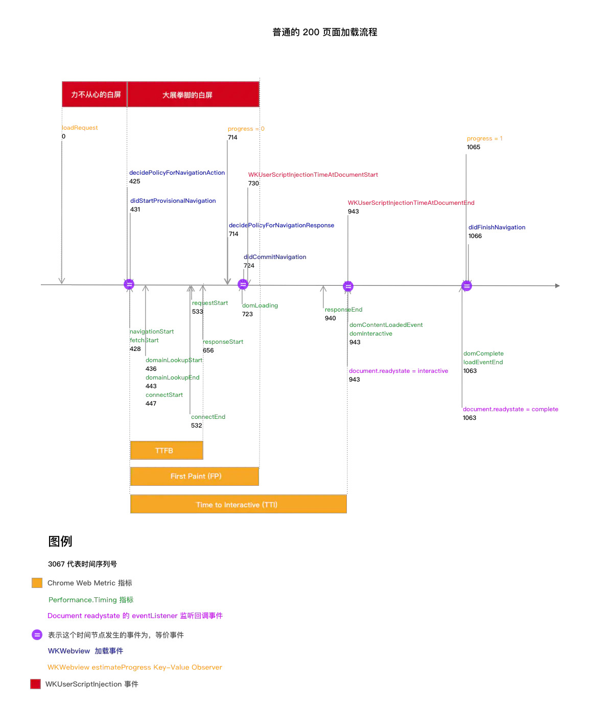

# WKWebView性能优化

## 1. 加载过程

1. 捕捉到`navigation`，触发回调

```swift
// Decides whether to allow or cancel a navigation
optional func webView(_ webView: WKWebView, didStartProvisionalNavigation navigation: WKNavigation!)
```
 
2. 开始加载

```swift
// Called when web content begins to load in a web view.
optional func webView(_ webView: WKWebView, didStartProvisionalNavigation navigation: WKNavigation!)
```

<!---->

## 2. 原生代码与H5的通信

### 2.1 JS 调用 Native

```swift
// 1.约定业务的 handler 名称
let kHandlerNameTest = "business_test"

// 2.定义一个处理 Test 业务的类
class TestScriptMessageHandler: NSObject {
    
}

// 3.实现 WKScriptMessageHandler 协议
extension TestScriptMessageHandler: WKScriptMessageHandler {
    func userContentController(_ userContentController: WKUserContentController, didReceive message: WKScriptMessage) {
        // 根据接收到的消息和参数进行原生业务处理
        let _ = message.name
        let _ = message.body
    }
}


// 4.实例化并将其注册到 webkit
let testHandler = TestScriptMessageHandler()
let webView = WKWebView()

// viewWillAppear 注册
webView.configuration.userContentController.add(testHandler, name: kHandlerNameTest)

// viewWillDisapear 移除
webView.configuration.userContentController.removeScriptMessageHandler(forName: kHandlerNameTest)
```

```js
// 5.js 进行调用
window.webkit.messageHandlers.kHandlerNameTest.postMessage(null);
```

### 2.2 Native 调用 JS

```swift
webView.evaluateJavaScript("alert('test');") { (result, error) in
        
}
```

### 2.3 JS 注入

```swift
// 要注入的 JavaScript 源码
let source = "function test(){ alert('test'); }"
/*
 注入时机
 atDocumentStart: Inject the script after the document element is created, but before any other content is loaded.
 atDocumentEnd: Inject the script after the document finishes loading, but before other subresources finish loading.
 */
let injectionTime = WKUserScriptInjectionTime.atDocumentEnd

// 是否只在主页面注入
let mainFrameOnly = false
// 创建 UserScript
let userScript = WKUserScript(source: source, injectionTime: injectionTime, forMainFrameOnly: mainFrameOnly)
// 进行注入
webView.configuration.userContentController.addUserScript(userScript)
// 移除所有已注入的js
webView.configuration.userContentController.removeAllUserScripts()
```

> 通过 JS 注入和 通信相结合，让WebView拥有更灵活的业务实现能力。
> 比如监测页面中按钮的点击事件、获取页面数据等。

### 3. jscore

### 4. url scheme

控制资源加载
隐藏某些 dom 元素

参考链接：

- [WKWebview 加载过程中的性能指标图解](https://www.jianshu.com/p/d7e79b58979c)
- [InfoQ：70%以上业务由H5开发，手机QQ Hybrid 的架构如何优化演进？](https://mp.weixin.qq.com/s/evzDnTsHrAr2b9jcevwBzA)
- [腾讯Bugly：移动端本地 H5 秒开方案探索与实现](https://mp.weixin.qq.com/s/0OR4HJQSDq7nEFUAaX1x5A)
- [网易传媒技术团队：网易新闻客户端 H5 秒开优化](https://mp.weixin.qq.com/s/AV2SwFfwwJH7xyrIBJemgw)
- [掘金：iOS app秒开H5优化探索](https://juejin.im/post/5c9c664ff265da611624764d)
